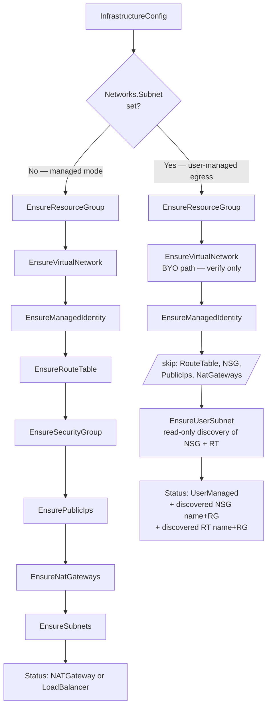

# User-Managed Egress via BYO Subnet

> **Companion document**: an implementation checklist derived from this proposal lives in [`flexible-network-configuration-spec.md`](./flexible-network-configuration-spec.md). This proposal is the source of truth for design intent and acceptance criteria; the spec captures the concrete file paths, code sketches, and testing surface a coding agent (or engineer) needs to implement it.

<!-- toc -->

- [Summary](#summary)
- [Motivation](#motivation)
  - [Goals](#goals)
  - [Non-Goals](#non-goals)
- [Background: today's egress in `provider-azure`](#background-todays-egress-in-provider-azure)
- [Background: Azure egress patterns](#background-azure-egress-patterns)
- [Proposal](#proposal)
  - [API changes](#api-changes)
  - [Derived mode](#derived-mode)
  - [Validation rules](#validation-rules)
  - [Reconciler behavior](#reconciler-behavior)
  - [Status shape](#status-shape)
  - [Cloud-provider config (`azure.json`)](#cloud-provider-config-azurejson)
  - [`allow-egress` dummy Services](#allow-egress-dummy-services)
  - [Route-controller and overlay-CNI opt-out](#route-controller-and-overlay-cni-opt-out)
  - [NSG mutation contract](#nsg-mutation-contract)
  - [Route-table and NSG ownership](#route-table-and-nsg-ownership)
  - [Bastion](#bastion)
- [Configuration patterns](#configuration-patterns)
- [Migration and immutability](#migration-and-immutability)
- [User responsibilities](#user-responsibilities)
- [Deletion / teardown semantics](#deletion--teardown-semantics)
- [Documentation](#documentation)
- [Acceptance criteria](#acceptance-criteria)
- [Risks and upstream conflicts](#risks-and-upstream-conflicts)
- [Alternatives considered](#alternatives-considered)
- [Resolved questions](#resolved-questions)
- [Out of scope](#out-of-scope)

<!-- /toc -->

## Summary

Give shoot owners full control over Azure egress by allowing them to bring their own worker **subnet** — pre-attached to their own route table (typically with a `0.0.0.0/0` route to a firewall/NVA, or no default route at all for network-isolated clusters) and their own network security group. In this mode Gardener's _infrastructure reconciler_ stops creating and managing the subnet, the route table, the NSG, and the NAT Gateway, and stops deploying the LB-egress workaround Services. The user pre-provisions the subnet + route table + NSG (the NSG is required; the route table is optional under overlay CNI); Gardener only _discovers and references_ them.

The network security group is a user-owned concern in BYO mode. The user attaches an NSG to their subnet before shoot creation, and Gardener discovers it at reconcile time. Because the BYO subnet must be dedicated to a single shoot (see the [Route-table and NSG ownership](#route-table-and-nsg-ownership) section), the subnet-attached NSG is 1:1 with the shoot by construction — so the CCM's `RetainSecurityGroup` behavior operates on a per-shoot NSG and the shared-NSG mutual-destruction hazard cannot arise. The Azure CCM writes `Service type=LoadBalancer` ingress rules onto this NSG, and the bastion controller writes bastion SSH rules onto it, exactly as they do in managed-mode shoots today. In managed mode the NSG is created and attached to the subnet by Gardener (unchanged from today). See the [NSG mutation contract](#nsg-mutation-contract) for details.

> [!IMPORTANT]
> **The BYO subnet must not be shared across shoots.** The route table attached to the subnet is on the seed CCM's write path in non-overlay mode (per-node pod-CIDR routes), and Azure only allows one RT association per subnet. Two shoots sharing the subnet therefore share the RT, and their CCMs mutually delete each other's routes. The same 1:1-subnet-to-NSG mapping applies to the NSG, so a shared subnet would also mean a shared NSG on the CCM's write path — with the same mutual-destruction outcome. Overlay-CNI shoots do not have the specific writer conflict on routes, but the NSG write path is unaffected by CNI mode — so the "one shoot per subnet" rule is uniform. See [Route-table and NSG ownership](#route-table-and-nsg-ownership) for the full analysis.

This covers two related egress topologies: (a) a user-owned route table with a `0.0.0.0/0` route to a firewall or virtual appliance, and (b) a user-owned subnet with no default route at all — for network-isolated shoots that terminate all traffic via Private Endpoints. Both are collapsed into a single "user-managed egress" Gardener mode signaled by the presence of a BYO subnet reference.

## Motivation

Today, `provider-azure` locks shoot owners into one of two outbound topologies:

1. NAT Gateway (with optional BYO public IPs), or
2. A Standard Load Balancer forced into existence by two synthetic `allow-{tcp,udp}-egress` `Service type=LoadBalancer` objects in `kube-system` — a workaround for Standard SLB's default-deny-outbound behavior (chart at `charts/internal/shoot-system-components/charts/allow-egress`).

Common enterprise requirements dictate additional options:

- **Central firewall egress** — send all `0.0.0.0/0` from workers to an Azure Firewall / third-party NVA sitting in a hub VNet. Requires a user-owned route table on the worker subnet with a `VirtualAppliance` next hop.
- **No egress at all** — network-isolated / air-gapped shoots that terminate all traffic via Private Endpoints; no public IP anywhere.
- **BYO subnet inside a BYO VNet** — many enterprises pre-provision every subnet through their platform team and hand the shoot owner a subnet ID.

### Goals

- Support the two "user-managed egress" topologies described in the Summary — firewall-based egress via a user-owned route table with a default route to a virtual appliance, and no-egress (network-isolated) shoots with no default route.
- Support **BYO subnet** in the single-subnet (non-zoned) layout, requiring BYO VNet.
- Skip creation of the route table, worker NSG, NAT Gateway, and the LB-egress dummy Services when the user has taken over egress. The NSG in BYO mode is user-owned and discovered from the subnet (see [NSG mutation contract](#nsg-mutation-contract)).
- Zero breaking changes for existing shoots: opting in is purely additive.

### Non-Goals

- **No new `OutboundType` enum.** Per the design decision, mode is derived from BYO field presence.
- **No BYO subnet in the multi-subnet (zoned) layout**. `Networks.Zones[i].Subnet` is out of scope.
- **No BYO NAT Gateway** (the resource) as an API field. A user who wants NAT-based egress attaches their own NAT Gateway to the BYO subnet out-of-band; Gardener never creates, references, or reads it. The `Networks.NatGateway` field stays managed-mode-only (validation rejects it in BYO mode). This is not a gap — the upstream CCM has no notion of a NAT Gateway, so nothing in `azure.json` would ever reference it. See [Pattern 3 — BYO subnet with a user-attached NAT Gateway](#pattern-3--byo-subnet-with-a-user-attached-nat-gateway).
- **No BYO Route Table as a separate API field.** The route table is discovered from the subnet's existing `RouteTable` association; the user attaches it out-of-band.
- **No BYO NSG as a separate API field.** In BYO-subnet mode the NSG is discovered from the subnet's `NetworkSecurityGroup` association (which the user attaches before shoot creation). The NSG must exist — Gardener does not create it in BYO mode. In managed mode Gardener creates the NSG in the shoot's cluster RG as today. Sharing an NSG across shoots is prevented by the same unique-per-shoot subnet rule that governs the route table — see [Route-table and NSG ownership](#route-table-and-nsg-ownership).
- **No shared BYO subnet across shoots.** The route table (and the NSG attached to the same subnet) is on the CCM's write path in non-overlay mode. Azure supports only one RT / NSG association per subnet, so shared subnet = shared RT + shared NSG = writer conflict. See [Route-table and NSG ownership](#route-table-and-nsg-ownership).
- **No cleanup of orphan routes or NSG rules on shoot deletion.** If the CCM has written per-node pod-CIDR routes into the user's RT or `Service type=LoadBalancer` rules onto the user's NSG, and the graceful teardown fails to remove them, those artifacts remain in the user's resources. The user is responsible for pruning them.

## Background: today's egress in `provider-azure`

- `InfrastructureConfig` API: `pkg/apis/azure/types_infrastructure.go`. BYO surface today = VNet (`VNet.Name`+`VNet.ResourceGroup`), user-assigned managed identity, DDoS plan, and public IPs consumed by a Gardener-managed NAT Gateway.
- Reconciler is flow-based: `pkg/controller/infrastructure/infraflow/flow_context.go:150-177`. Task graph creates RG → VNet → Identity → RouteTable → NSG → PublicIPs → NatGateways → Subnets. The route table (`worker_route_table`) is created **empty**; the seed-hosted CCM populates per-node pod-CIDR routes via `--configure-cloud-routes=true` (chart `charts/internal/seed-controlplane/charts/cloud-controller-manager/templates/cloud-controller-manager.yaml:48`).
- `cloud-provider-config` chart hard-codes `loadBalancerSku=standard` (`charts/internal/cloud-provider-config/templates/cloud-provider-config.tpl:12`). Neither `outboundType` nor `disableOutboundSNAT` is ever set.
- Egress via SLB works today only because of the two `allow-{tcp,udp}-egress` Services pinned into `kube-system` (deployment gated at `pkg/controller/controlplane/valuesprovider.go:766-771`; opt-out annotation `azure.provider.extensions.gardener.cloud/skip-allow-egress`).
- Existing derived status field `InfrastructureStatus.Networks.OutboundAccessType` currently takes `NATGateway` | `LoadBalancer`. This proposal adds a third value.

## Background: Azure egress patterns

Azure workloads inside a VNet can reach the internet through several distinct topologies. From the standpoint of the shoot's infrastructure, they are:

| Egress path                                                                     | Automation creates            | User provides                                             |
| ------------------------------------------------------------------------------- | ----------------------------- | --------------------------------------------------------- |
| Standard Load Balancer (frontend PIP + outbound rule)                           | LB + PIP + backend pool       | —                                                         |
| NAT Gateway (`Standard` or `StandardV2`, zone-redundant) attached to the subnet | NAT + PIP, attached to subnet | —                                                         |
| Pre-existing NAT Gateway attached to a pre-existing subnet                      | nothing                       | BYO VNet + subnet + NAT (attached to subnet)              |
| Route table on the subnet with a `0.0.0.0/0` route to a firewall / NVA          | nothing                       | BYO VNet + subnet + user route table with a default route |
| No egress infrastructure at all (network-isolated)                              | nothing                       | BYO VNet + subnet; no default route required              |

Critical fact confirmed from upstream `kubernetes-sigs/cloud-provider-azure` source: the CCM has **zero awareness of any high-level "outbound type" abstraction** — no such field is read from `azure.json`. The CCM only creates LB + PIP reactively for `Service type=LoadBalancer`, never proactively at startup. Any outbound-topology decisions must be made by whatever provisions the subnet, route table, NAT, and load balancer — i.e. Gardener's infrastructure reconciler. The only related knob the CCM does honor is `disableOutboundSNAT` (per-`LoadBalancingRule` flag; it should be set to `true` whenever the SLB is not the intended egress path).

Consequence for Gardener: implementing user-managed egress is entirely a matter of what Gardener chooses **not** to create at reconcile time, plus a small `azure.json` tweak (`disableOutboundSNAT: true`) plus deciding whether to skip the allow-egress dummy Services.

## Proposal

### API changes

Two additions on `InfrastructureConfig.Networks`:

1. **`Subnet` — an optional reference to an existing subnet inside the (also user-provided) VNet.** When set, Gardener switches into user-managed-egress mode. The reference carries only a subnet name, not a resource group — in ARM, a subnet is a child resource of its VNet, so the VNet's resource group (already available on `Networks.VNet.ResourceGroup`) plus VNet name plus subnet name uniquely identify it.
2. **`Subnet.SkipRouteReconciliation` — an optional boolean, default `false`.** When `true`, the seed CCM's route controller is disabled and Gardener does not require the BYO subnet to have a route table attached. Intended for shoots using an overlay CNI (Cilium/Calico with VXLAN or Geneve) where pod-CIDR routes are not needed in the underlying VNet.

No new mode/enum is added. Presence of `Networks.Subnet` alone signals user-managed-egress mode (see [Derived mode](#derived-mode)).

One status-only addition: the existing `OutboundAccessType` enum on `InfrastructureStatus.Networks` gains a third value **`UserManaged`**, set when the user brought their own subnet and did not enable a NAT Gateway. The API user does not set this; it is derived at reconcile time.

Concrete Go type definitions are in the companion spec document — see [`flexible-network-configuration-spec.md`](./flexible-network-configuration-spec.md).

### Derived mode

The mode is signaled solely by the presence of `Networks.Subnet`. No enum, no marker field, no annotation. The reconciler branches on `Networks.Subnet != nil`; the resulting status carries `OutboundAccessType=UserManaged` and downstream code (allow-egress gating, azure.json field emission, etc.) branches on the status value.

### Validation rules

Added in `pkg/apis/azure/validation/infrastructure.go`.

When `Networks.Subnet != nil`:

| Rule                                                                    | Rationale                                                                                                      |
| ----------------------------------------------------------------------- | -------------------------------------------------------------------------------------------------------------- |
| `Networks.VNet.Name` and `Networks.VNet.ResourceGroup` must both be set | User-managed egress requires a BYO VNet — Gardener cannot own the VNet if it doesn't own the subnet inside it. |
| `Networks.VNet.CIDR` must be unset                                      | BYO VNet — CIDR is discovered, not declared.                                                                   |
| `Networks.VNet.DDosProtectionPlanID` must be unset                      | BYO VNet — user manages the plan on their side.                                                                |
| `Networks.Workers` must be unset                                        | Workers CIDR is discovered from the actual subnet.                                                             |
| `Networks.Zones` must be empty                                          | Single-subnet layout only.                                                                                     |
| `Networks.NatGateway` must be nil                                       | Gardener does not manage a NAT in this mode; if the user wants one, they attach it to their subnet themselves. |
| `Networks.ServiceEndpoints` must be empty                               | User manages service endpoints on their own subnet.                                                            |
| `Networks.Subnet.Name` non-empty (RFC-1123-ish per Azure naming rules)  | Standard field validation.                                                                                     |

**Runtime validation** — a new pre-flight validator runs before reconcile and checks the referenced ARM resources actually exist and are compatible. It complements the API-level rules above; API-level rules catch static mistakes at admission time, runtime rules catch mismatches with the live cloud state:

| Rule                                                                                                           | Rationale                                                                                                                                                                                                                   |
| -------------------------------------------------------------------------------------------------------------- | --------------------------------------------------------------------------------------------------------------------------------------------------------------------------------------------------------------------------- |
| The referenced subnet must exist in the BYO VNet                                                               | Fail fast with a clear error.                                                                                                                                                                                               |
| The subnet must have a `RouteTable` association (`subnet.properties.routeTable.id != nil`), unless `Networks.Subnet.SkipRouteReconciliation=true` | The seed CCM runs the route controller by default and needs somewhere to write per-node pod-CIDR routes. Relaxed for overlay CNI shoots that opt out (see [Route-controller and overlay-CNI opt-out](#route-controller-and-overlay-cni-opt-out)).                                                                                                                                                                              |
| The subnet must have a `NetworkSecurityGroup` association (`subnet.properties.networkSecurityGroup.id != nil`) | Upstream CCM's `EnsureLoadBalancer` needs a non-empty `securityGroupName` in `azure.json` to program per-`Service type=LoadBalancer` ingress rules. Gardener discovers the NSG from the subnet; it does not create one in BYO mode. |
| The subnet's CIDR must be a subset of `shoot.spec.networking.nodes` and non-overlapping with pods/services     | Same rule that validates managed subnets today.                                                                                                                                                                             |
| The discovered route table and NSG must be in the same subscription as the shoot                               | Cross-subscription references aren't supported by CCM's `azure.json`. There is **no** cluster-RG-or-VNet-RG constraint: any RG in the subscription is fine (see [Cloud-provider config](#cloud-provider-config-azurejson)). |

The subnet's `NetworkSecurityGroup` association is **required** in BYO mode (unlike the route table, which is optional under `SkipRouteReconciliation`): the upstream CCM cannot program `Service type=LoadBalancer` ingress rules without a `securityGroupName`. The user attaches the NSG to their subnet before shoot creation; Gardener discovers it and never creates, replaces, or mutates the resource itself. Runtime mutation of the NSG's `securityRules` collection by the CCM and the bastion controller is unchanged from managed mode — see [NSG mutation contract](#nsg-mutation-contract). The user is responsible for ensuring the NSG permits the traffic flows Kubernetes requires — see [Configuration patterns](#configuration-patterns) for the specifics.

**Immutability** (`ValidateInfrastructureConfigUpdate`):

- `Networks.Subnet.Name` is immutable once set.
- Transitioning to or from user-managed-egress mode after cluster creation is **forbidden** (i.e. `Networks.Subnet` cannot be added or removed on an existing shoot). Such a transition would recreate/delete route tables, NSGs, NAT gateways, and PIPs while workloads run — high operational blast radius (egress IPs change, connections drop).

### Reconciler behavior

Modifications live in `pkg/controller/infrastructure/infraflow/`.

**Task-gating matrix**:

| Task                    | Condition                                                                                                                                |
| ----------------------- | ---------------------------------------------------------------------------------------------------------------------------------------- |
| `EnsureResourceGroup`   | unchanged                                                                                                                                |
| `EnsureVirtualNetwork`  | unchanged (BYO VNet path already exists)                                                                                                 |
| `EnsureManagedIdentity` | unchanged                                                                                                                                |
| `EnsureRouteTable`      | **skip if `IsUsingUserManagedEgress()`**                                                                                                 |
| `EnsureSecurityGroup`   | **skip if `IsUsingUserManagedEgress()`**                                                                                                 |
| `EnsurePublicIps`       | already naturally skipped (no NAT configured)                                                                                            |
| `EnsureNatGateways`     | already naturally skipped                                                                                                                |
| `EnsureSubnets`         | **new branch: `EnsureUserSubnet`** — verify existence, fetch RT + NSG IDs/names, populate whiteboard; do NOT patch any subnet properties |

The flow-level gating:



**New reconciler task** `EnsureUserSubnet` — active only in BYO mode. It:

1. Reads the referenced subnet from Azure.
2. Verifies the subnet exists in the BYO VNet, that its CIDR is compatible with the shoot's networking config, that it has an NSG attached, and that it has a route table attached unless `SkipRouteReconciliation=true`.
3. Parses the NSG and route table ARM IDs into `(resourceGroup, name)` pairs and stores them for status emission and `azure.json` rendering.
4. Never issues a `PUT`/`PATCH` on the subnet itself — the discovery is read-only.

Gardener does not tag any of the BYO resources. Sharing the subnet across shoots is forbidden (see [Route-table and NSG ownership](#route-table-and-nsg-ownership)), so the "which shoots reference this resource" observability question that would justify a shared-tag scheme does not arise.

### Status shape

The `RouteTable` and `SecurityGroup` status types both gain an optional `ResourceGroup` field — additive and backward-compatible (nil in existing managed shoots, where the resources live in the cluster RG by convention). Populated in BYO-subnet mode where they may live in any RG within the shoot's subscription.

`InfrastructureStatus.Networks` mapping in BYO-subnet mode:

| Status field                         | In BYO-subnet mode                                                                                           |
| ------------------------------------ | ------------------------------------------------------------------------------------------------------------ |
| `Networks.VNet.{Name,ResourceGroup}` | user-provided values, unchanged                                                                              |
| `Networks.Subnets[]`                 | one entry: `{Purpose: PurposeNodes, Name: <BYO subnet name>, Zone: nil, Migrated: false, NatGatewayID: nil}` |
| `Networks.Layout`                    | `SingleSubnet`                                                                                               |
| `Networks.OutboundAccessType`        | **new value** `UserManaged`                                                                                  |
| `RouteTables[]`                      | one entry with the discovered RT `Name` + `ResourceGroup`; **omitted entirely** if `SkipRouteReconciliation=true` and no RT is attached |
| `SecurityGroups[]`                   | one entry with the discovered NSG `Name` + `ResourceGroup`                                                   |
| `EgressCIDRs`                        | **nil** (Gardener has no knowledge of the user's egress IPs)                                                 |

The last point matters: today `shoot.status.provider.egressCIDRs` is populated from the NAT Gateway's public IPs. In user-managed egress mode, Gardener has no reliable way to know what IPs the user's firewall / NVA egresses through. Downstream consumers that rely on it must handle nil; document that reliably knowing egress IPs in this mode requires out-of-band information from the user.

### Cloud-provider config (`azure.json`)

Three concerns for how Gardener renders the shoot's `azure.json`:

1. **Existing fields already work.** `resourceGroup`, `vnetName`, `vnetResourceGroup`, `subnetName`, `routeTableName`, `securityGroupName` are already sourced from `InfrastructureStatus`; once the status is populated correctly in BYO mode, they pick up the discovered BYO values automatically.
2. **Resource-group overrides.** When the discovered NSG or route table lives in an RG other than the shoot's cluster RG, `azure.json` must additionally emit the upstream CCM fields `securityGroupResourceGroup` and `routeTableResourceGroup`. Both default to `resourceGroup` if unset, so today's managed-mode shoots remain unchanged. Emitting them lets the NSG and RT live in **any resource group in the same subscription** as the shoot.
3. **Outbound SNAT suppression.** When `OutboundAccessType == UserManaged`, `azure.json` sets `disableOutboundSNAT: true`. This is a cluster-wide instruction to the upstream CCM: every `Service type=LoadBalancer` reconcile will produce LB rules with `DisableOutboundSnat=true`, ensuring the LB frontend never becomes an accidental egress path bypassing the user's route table.

A fourth concern applies in the [route-controller opt-out](#route-controller-and-overlay-cni-opt-out) case: the seed-controlplane CCM's `--configure-cloud-routes` flag becomes `false`. This is a separate lever from `azure.json` — it's a CCM command-line flag rendered by the seed-controlplane chart.

### `allow-egress` dummy Services

The gating in `deployAllowEgressChart` is extended: the two dummy Services are deployed only when `OutboundAccessType == LoadBalancer`. In `UserManaged` mode they are skipped. In `NATGateway` mode they were already skipped by the existing logic. The pre-existing `skip-allow-egress` shoot annotation still overrides the gating for advanced LB-mode users who want to manage egress themselves.

### Route-controller and overlay-CNI opt-out

There are two operating modes for pod-CIDR routing on Azure:

**Default (route-controller enabled)** — the seed CCM runs with `--configure-cloud-routes=true` and writes per-node pod-CIDR routes into the route table associated with the worker subnet. This is what today's shoots do; it matches the historic kubenet-style routing model. In BYO-subnet mode the CCM writes those routes into the user's route table, which has three implications the user must accept:

1. The user must not run competing automation (Terraform / policy engines) against the route table that reverts CCM's per-node routes.
2. Every node created by MCM results in a new route in the route table. Very large clusters may approach the Azure route-table limit (400 routes per table, extensible to 1000 via a support case).
3. The user's default route (`0.0.0.0/0` to firewall / NVA) coexists peacefully with per-node routes because the per-node routes are more specific (pod CIDR /24). No conflict.

**Overlay-CNI (route-controller disabled)** — shoots using an overlay CNI (Cilium with VXLAN or Geneve, Calico with VXLAN, etc.) do not need pod-CIDR routes in the underlying VNet: pod-to-pod traffic is encapsulated at the node level. For those shoots Gardener should be able to leave the user's route table completely untouched.

The proposal introduces an opt-out signal that turns the route controller off:

- A new optional field, `Networks.Subnet.SkipRouteReconciliation *bool` (default `false` — preserves today's behavior).
- When `true`, the seed CCM runs with `--configure-cloud-routes=false` and the reconciler does not require the BYO subnet to have a route table attached at all. If a route table is attached, Gardener still discovers and references it in `azure.json` (for consistency and for the CCM's LB code paths that read route-table state), but no per-node routes are written.
- Validation adjusts accordingly: the "subnet must have a `RouteTable` association" rule from [Validation rules](#validation-rules) is relaxed when `SkipRouteReconciliation=true`.

The user takes ownership of using an overlay CNI. Gardener does not introspect the shoot's `networking.type` or the CNI's configuration to auto-derive this — the field is an explicit opt-in with clear semantics, and misconfiguration (setting it `true` while using a non-overlay CNI) is the user's responsibility.

### NSG mutation contract

**Who owns the NSG.**

- **Managed mode**: Gardener creates the NSG (`<technicalName>-workers`) in the shoot's cluster RG and attaches it to the worker subnet. This is unchanged from today.
- **BYO-subnet mode**: the user brings an NSG attached to their subnet before shoot creation. Gardener discovers it via `subnet.properties.networkSecurityGroup.id` and threads the resulting name+RG into `InfrastructureStatus.SecurityGroups[0]` and `azure.json` (`securityGroupName` + `securityGroupResourceGroup`). The NSG must exist — Gardener neither creates nor deletes it. Its lifecycle is entirely on the user's side.

The BYO-subnet mode does not need a separate Gardener-owned NSG because the BYO subnet is dedicated to one shoot (see [Route-table and NSG ownership](#route-table-and-nsg-ownership)). Any NSG attached to that subnet is therefore 1:1 with the shoot, and the CCM's `RetainSecurityGroup` behavior operates on a per-shoot NSG — the shared-NSG mutual-destruction hazard cannot arise.

**What the infrastructure reconciler does in BYO-subnet mode**: reads `subnet.properties.networkSecurityGroup.id`, parses it into `(resourceGroup, name)`, stores it on the whiteboard, and emits it in `InfrastructureStatus.SecurityGroups[0]`. Never mutates the subnet, the NSG, or any rule on the NSG. Does not delete the NSG on shoot teardown (it belongs to the user).

**What the Azure CCM does to the NSG at runtime** — implemented in upstream `reconcileSecurityGroup` at `pkg/provider/azure_loadbalancer.go:3401`, invoked from `EnsureLoadBalancer` (`:163`) and `EnsureLoadBalancerDeleted` (`:482`). For each `Service type=LoadBalancer` reconcile:

| Step | Operation                                     | Upstream ref | When                                                               | Effect on NSG                                                                                                                                                                    |
| ---- | --------------------------------------------- | ------------ | ------------------------------------------------------------------ | -------------------------------------------------------------------------------------------------------------------------------------------------------------------------------- |
| 1    | `nsgRepo.GetSecurityGroup(ctx)`               | `:3424`      | always                                                             | Read-only: `GET` on the NSG in `securityGroupResourceGroup` (or falls back to `resourceGroup`).                                                                                  |
| 2    | `accessControl.CleanSecurityGroup(...)`       | `:3491`      | Service delete only                                                | Drops the rules previously added for this Service (name-matched by Service hash).                                                                                                |
| 3    | `accessControl.PatchSecurityGroup(...)`       | `:3498`      | Service create/update, iff `!disableLoadBalancerNSGRule` (`:3497`) | Adds allow-rule: source = `Internet` service tag or `spec.loadBalancerSourceRanges`; destination = LB frontend IPs (or backend IPs if `disableFloatingIP`); port = Service port. |
| 4    | `accessControl.RetainSecurityGroup(...)`      | `:3520`      | Service create/update                                              | Sweeps stale CCM-authored rules whose target destinations no longer exist. Safe because the NSG is exclusive to this cluster (subnet not shared).                                |
| 5    | `ensureSecurityGroupTagged(rv)`               | `:3532`      | always                                                             | Adds cluster tags to the NSG iff `az.Tags`/`az.TagsMap` are set. **No-op for Gardener** — Gardener does not populate `Tags`/`TagsMap` in `cloud-provider-config`.                |
| 6    | `nsgRepo.CreateOrUpdateSecurityGroup(ctx,rv)` | `:3539`      | if steps 2–5 mutated the NSG                                       | Writes the updated NSG back to ARM.                                                                                                                                              |

**What the bastion controller does to the NSG**: for each Bastion resource lifecycle, adds/removes 4 IP-scoped rules on the same NSG — 2 SSH-in from operator CIDRs, 1 SSH-out to worker CIDRs, and 1 deny-all-out that ensures the bastion has no internet egress. Rule names are prefixed `<bastion-instance-name>-` and removed on Bastion delete.

Both flows are additive, name-scoped, and self-cleaning under normal operation. In BYO mode they write to a user-owned NSG, which means Gardener needs write permission on the NSG's RG — see the permission implication below.

**Escape hatch for CCM NSG mutation** — the annotation `service.beta.kubernetes.io/azure-disable-load-balancer-nsg-rule: "true"` on a `Service type=LoadBalancer`:

- Skips step 3 (`PatchSecurityGroup`) — no rules added for that Service.
- Steps 4, 5, 6 still run, but each is a no-op when nothing has been added:
  - `RetainSecurityGroup` only removes stale CCM-authored rules; if we never added any, none to remove.
  - `ensureSecurityGroupTagged` is already a no-op for Gardener.
  - `CreateOrUpdateSecurityGroup` is only invoked if steps 2–5 mutated the NSG.
- If **every** LB Service in the shoot carries the annotation, the CCM's NSG interaction becomes read-only (one `GET` per reconcile; zero writes).

There is no cluster-wide upstream equivalent. Cluster-wide forcing (e.g. via a mutating webhook that stamps the annotation on every LB Service) is not implemented here.

**Permission implication**: Gardener's Azure principal must have `Microsoft.Network/networkSecurityGroups/securityRules/*` (or equivalent role) on the NSG's resource group — whichever RG that turns out to be. In BYO setups where the NSG lives in a security-team-owned RG with read-only permissions for the shoot principal, LB Services and Bastion will fail at reconcile time. This is a user-facing prerequisite.

### Route-table and NSG ownership

Both the route table and the NSG are attached to the subnet (Azure enforces exactly one association of each per subnet). In BYO-subnet mode the subnet is user-owned, so both are also user-owned — Gardener cannot substitute a shadow RT or NSG of its own without mutating the user's subnet, which BYO forbids.

The seed CCM writes to both:

- **Route table**: one per-node pod-CIDR route in non-overlay CNI shoots (kubenet-style). Overlay CNI shoots (Calico or Cilium with VXLAN/Geneve — the Gardener default) disable the CCM's route controller, so no RT writes happen.
- **NSG**: one or more ingress rules per `Service type=LoadBalancer`, on every reconcile. This is independent of CNI mode — overlay does not silence NSG writes.

#### NSG ownership: two approaches considered

1. **Gardener creates the NSG in the shoot's cluster RG and attaches it to worker NICs (via the MCM machine class).** The user's subnet-attached NSG (if any) stays untouched at the subnet layer; Gardener's NSG stacks on the NIC layer. Trade-offs:
    - Enables shared BYO subnets between shoots (each shoot has its own NSG at the NIC layer, no writer conflict on the CCM side).
    - Requires an API extension in `machine-controller-manager-provider-azure` (`SecurityGroupID` on `AzureNetworkProfile`), wiring in the worker delegate and machine-class chart, subscription-ID plumbing to compose the ARM resource ID, and a matching change in the bastion controller so the bastion NIC also carries the NSG.
    - Does not solve the shared-RT problem — that remains a per-shoot resource regardless.
2. **The user brings the NSG attached to their subnet; Gardener only discovers it.** Trade-offs:
    - Zero code surface for the NSG mechanism — it reuses the existing managed-mode CCM configuration path (`securityGroupName` + `securityGroupResourceGroup` in `azure.json`).
    - The NSG becomes writer-contended across shoots the moment a subnet is shared. Since a shared subnet is already forbidden by the RT constraint (each shoot needs its own RT, and each subnet allows only one RT), this is not a new limitation — it's the same "one subnet per shoot" rule applied to a second axis.

**Chosen: approach 2.** Rationale: the shared-subnet capability that approach 1 enables is not achievable end-to-end without also solving the RT side. Since the RT cannot be per-shoot on a shared subnet (Azure's 1:1 subnet-to-RT constraint), and the extension is not going to write its own route-controller in place of the seed CCM, shared subnets stay off the table under any current architecture. Approach 1 would therefore ship the NIC-NSG complexity without ever unlocking its intended use case.

#### Consequences

- **The BYO subnet is dedicated to a single shoot.** The user must not reference the same subnet from multiple Gardener Azure shoots.
- **Enforcement is docs-only**, not admission-time. Cross-shoot inspection is not a pattern this extension uses today.
- **The path to shared subnets requires both**: (a) an overlay CNI in every affected shoot (removes RT contention), *and* (b) a per-shoot NSG mechanism that decouples from the subnet layer (approach 1 above, or an alternative like managing LB Service NSG rules ourselves and stamping the `service.beta.kubernetes.io/azure-disable-load-balancer-nsg-rule` annotation cluster-wide). Overlay CNI alone is not sufficient because the CCM writes NSG rules regardless of CNI mode. Neither piece is currently planned.
- **Orphan artifacts on shoot deletion**: routes on the RT and `k8s-azure-lb_*` rules on the NSG that the CCM did not manage to clean up before teardown (CCM crash, force-delete, transient Azure API errors) will remain in the user's resources pointing at IPs that no longer exist. Gardener does not clean these up. The user is responsible for pruning them if they matter.

**Permission implication**: Gardener's Azure principal needs read + write on both the RT's RG (routes) and the NSG's RG (security rules) — typically the same RG or an operator's central-networking RG. Both may live in any RG in the shoot's subscription.

### Bastion

Bastion is **fully supported** in BYO-subnet mode. No new API surface is required.

The bastion controller reads the worker subnet from `InfrastructureStatus.Networks.Subnets[0]` and the NSG (name + resource group) from `InfrastructureStatus.SecurityGroups[0]`. Both are populated uniformly across managed and BYO modes; only the NSG's ownership differs (Gardener-owned in cluster RG for managed mode, user-owned on the subnet for BYO mode). Bastion adds/removes its four IP-scoped rules on that NSG the same way in both modes.

**Bastion's NSG mutation footprint** — four IP-scoped rules per bastion (see [NSG mutation contract](#nsg-mutation-contract)). The bastion has no internet egress by design (its own NSG rules include a deny-all-outbound), so no firewall allowlisting is required on the user's side for bastion egress.

**Bastion resource placement**: VM, disk, NIC, and the bastion's public IP are created in the shoot's cluster RG (unchanged). The NIC lives inside the BYO worker subnet in BYO mode, and inherits the user's subnet-attached NSG via the subnet association. The bastion controller writes its rules onto that NSG.

## Configuration patterns

### Pattern 1 — Firewall-based egress

```yaml
apiVersion: azure.provider.extensions.gardener.cloud/v1alpha1
kind: InfrastructureConfig
zoned: true
networks:
  vnet:
    name: hub-spoke-workers-vnet
    resourceGroup: platform-network-rg
  subnet:
    name: shoot-a-workers
```

User pre-provisions:

- The VNet `hub-spoke-workers-vnet` in `platform-network-rg`.
- A subnet `shoot-a-workers` inside that VNet.
- A route table attached to the subnet with a `0.0.0.0/0` route pointing to their Azure Firewall / NVA (next-hop = `VirtualAppliance` + firewall IP).
- An NSG attached to the subnet. This is **required** — the CCM needs a `securityGroupName` to program `Service type=LoadBalancer` ingress rules. It must permit the flows listed in [NSG mutation contract](#nsg-mutation-contract). Gardener discovers it from the subnet and never creates, replaces, or deletes it; the CCM and bastion controller mutate only its `securityRules` at runtime.
- Any firewall rules needed to reach the Azure endpoints required for a Kubernetes cluster to function — at minimum the `AzureCloud` service tag (ARM, IMDS, storage), the `AzureContainerRegistry` service tag, and the public MCR endpoint (`mcr.microsoft.com` and its CDN backends).

Gardener will:

- Verify the VNet, subnet, and its route-table + NSG associations exist.
- Skip creating a route table, NSG, NAT, LB, or allow-egress services.
- Discover the RT and NSG associations from the subnet at reconcile time and emit `cloud-provider-config` with `subnetName`, `routeTableName`, `securityGroupName` from the BYO resources, `vnetResourceGroup` from the BYO VNet, the optional `routeTableResourceGroup` / `securityGroupResourceGroup` overrides when those resources live in a foreign RG, plus `disableOutboundSNAT: true`.
- Continue to allow the CCM and bastion controller to add/remove narrowly-scoped rules on the user's NSG at runtime (see [NSG mutation contract](#nsg-mutation-contract)).

### Pattern 2 — No egress (network-isolated)

Identical `InfrastructureConfig` to Pattern 1. The user simply doesn't put a `0.0.0.0/0` route in their route table. Gardener cannot and does not validate the absence — that's the user's choice.

Prerequisites for this to actually work as a cluster:

- Private Endpoints for the API server (Gardener's private-cluster feature).
- Private Endpoints or Service Endpoints for any Azure services the workload needs.
- No dependency on public MCR, no dependency on public NTP, etc.

Documented as a supported topology; the user takes ownership of making the cluster viable.

### Pattern 3 — BYO subnet with a user-attached NAT Gateway

Same `InfrastructureConfig` shape as Pattern 1 — the presence of `Networks.Subnet` is the only signal. `Networks.NatGateway` **must not** be set (validation rejects it in BYO mode; see [Validation rules](#validation-rules)).

```yaml
apiVersion: azure.provider.extensions.gardener.cloud/v1alpha1
kind: InfrastructureConfig
zoned: true
networks:
  vnet:
    name: hub-spoke-workers-vnet
    resourceGroup: platform-network-rg
  subnet:
    name: shoot-a-workers
  # networks.natGateway is FORBIDDEN here — attach the NAT to the subnet out-of-band instead.
```

User pre-provisions, in addition to the VNet + subnet + NSG (+ optional route table) from Pattern 1:

- A NAT Gateway with its own public IP(s), **attached to the BYO subnet** out-of-band (before shoot creation). The user owns the full NAT + PIP lifecycle.

Gardener will:

- Verify the VNet, subnet, and NSG (+ optional RT) associations exist — exactly as Pattern 1. It does **not** inspect, reference, or manage the NAT Gateway.
- Skip creating a route table, NAT, LB, or allow-egress services.
- Emit the same `azure.json` as Pattern 1 (`disableOutboundSNAT: true` included).

Why the NAT is invisible to Gardener: the upstream CCM has no notion of a NAT Gateway — it is a subnet-attached egress mechanism, never referenced in `azure.json` (see [Background: Azure egress patterns](#background-azure-egress-patterns)). So "BYO subnet + user NAT" needs zero extra Gardener code beyond the BYO-subnet discovery already described. This is deliberately **not** the same as managed-mode NAT: in managed mode Gardener creates and owns the NAT (`Networks.NatGateway`); here the user owns it and Gardener never touches it. Exposing a "BYO NAT Gateway" API field would only make sense if Gardener referenced the resource, which it does not — hence the field stays managed-mode-only. `shoot.status.provider.egressCIDRs` remains nil in this pattern, since Gardener cannot read the user-owned NAT's public IPs (same caveat as Pattern 1).

### Pattern 4 — Managed VNet + managed NAT + managed subnet (unchanged)

Today's default. `Networks.Subnet` unset. Everything works exactly as before. Zero migration required for existing shoots. This is the **only** mode where `Networks.NatGateway` is honored — Gardener creates and owns the NAT Gateway and its public IPs.

## Migration and immutability

- **Existing shoots** keep working. `Networks.Subnet` is `+optional`.
- **New shoots** may opt in at creation time. Opting in requires setting `Networks.VNet.{Name,ResourceGroup}` (already supported).
- **In-place transition**: forbidden. Once created with `Networks.Subnet` set, it must stay set; once created without, it must stay unset. Enforced in `ValidateInfrastructureConfigUpdate` at `pkg/apis/azure/validation/infrastructure.go:469-513`. Rationale: transitioning between managed and user-managed egress mid-flight means recreating/deleting the route table + NSG + NAT + PIPs while workloads are running — disruptive, error-prone. Users who need to migrate can create a fresh shoot.
- **`Networks.Subnet.Name` immutable** once set.

## User responsibilities

Explicitly documented in `docs/usage/`:

The user MUST provide, before shoot creation:

1. A VNet.
2. A subnet inside that VNet, whose CIDR fits inside `shoot.spec.networking.nodes` and does not overlap `shoot.spec.networking.{pods,services}`. **The subnet must not be reused across shoots** — see [Route-table and NSG ownership](#route-table-and-nsg-ownership). Concretely: no other Gardener Azure shoot may reference this subnet in its own `InfrastructureConfig.Networks.Subnet.Name`.
3. A **network security group** attached to that subnet, dedicated to this shoot. The CCM writes `Service type=LoadBalancer` ingress rules onto it during shoot operation; the bastion controller writes bastion SSH rules onto it during Bastion lifecycle. Must permit the flows listed in [NSG mutation contract](#nsg-mutation-contract).
4. A **route table** attached to that subnet, dedicated to this shoot. For firewall-based egress usage, this route table should contain a `0.0.0.0/0` route to the user's firewall / NVA. For network-isolated usage, it may be empty (Gardener will still write pod-CIDR routes into it in non-overlay shoots). In overlay-CNI shoots (Gardener default), the route table may be omitted entirely.
5. Any firewall rules required for Azure control-plane traffic and container image pulls.
6. Both the NSG and the route table must be in the same Azure subscription as the shoot; they may live in any RG within that subscription.

The user MUST NOT:

- Reuse the referenced subnet, its NSG, or its route table across multiple Gardener Azure shoots. See [Route-table and NSG ownership](#route-table-and-nsg-ownership) for the CCM mutual-destruction hazard.
- Run competing automation (Terraform, policy engines) against the discovered NSG or route table in ways that fight the CCM/bastion controller's normal rule/route management.
- Block the flows listed in [NSG mutation contract](#nsg-mutation-contract) on the subnet's NSG.
- Rely on `shoot.status.provider.egressCIDRs` for firewall allowlisting on the receiving side — this field is empty in user-managed egress mode.
- Expect Gardener to clean up orphan CCM-authored rules on the NSG or orphan pod-CIDR routes on the RT after shoot deletion. See [Deletion / teardown semantics](#deletion--teardown-semantics).

## Deletion / teardown semantics

- BYO subnet is **never** deleted by Gardener.
- BYO VNet is **never** deleted by Gardener (already the case today).
- The BYO route table and NSG are **never** deleted by Gardener.
- Named rules added by the CCM (for LB Services) and the bastion controller (for Bastion resources) on the NSG are cleaned up on their owning resource's delete under graceful teardown. Failure modes (CCM crash mid-teardown, force-delete of the shoot, transient Azure API errors) can leave orphan rules. Gardener does not clean them up.
- **Orphan CCM-authored artifacts on the user's NSG and RT are not cleaned up by Gardener.**
    - In any CNI mode the CCM writes `k8s-azure-lb_*` ingress rules on the NSG for `Service type=LoadBalancer`, and the bastion controller writes `<bastion-instance-name>-*` rules for Bastion resources. Both are removed on graceful teardown of the owning resource. Failure modes (CCM crash, force-delete of the shoot, transient Azure API errors) can leave orphan rules on the NSG.
    - In non-overlay shoots the seed CCM writes one route per node into the user's route table. Graceful teardown removes them as MCM scales workers down and as the CCM observes Node deletions. The same failure modes can leave orphan routes on the RT ("blackhole" routes pointing at IPs that no longer exist).
    - The user is responsible for pruning any of these that remain. Overlay-CNI shoots are not affected by the RT side of this — the CCM's route controller is disabled and no per-node routes are ever written — but the NSG side still applies.
- Any load balancers created by CCM for `Service type=LoadBalancer` are cleaned up by the existing LB-in-foreign-VNet-RG cleanup path, which already handles the BYO-VNet case today.

## Documentation

Two documents added:

1. `docs/usage/user-managed-egress.md` — end-user how-to with:
   - Step-by-step Azure CLI / portal instructions to pre-provision VNet + subnet + NSG + RT.
   - Example route table configurations for firewall-based egress.
   - Discussion of the network-isolated variant (no default route) and its cluster-viability prerequisites (private API server, Private Endpoints for MCR, etc.).
   - The list of Azure endpoints that the cluster needs to reach (control plane, container registries, etc.).
   - The mandatory NSG flow list.
   - Explicit warning that `shoot.status.provider.egressCIDRs` will be empty.
   - Explicit warning that the subnet/RT/NSG are all dedicated per shoot.
2. `docs/usage/usage.md` — new subsection under the existing "Networking" section, cross-linking to (1).

## Acceptance criteria

Any implementation must pass the following scenarios end-to-end. They are grouped into regression scenarios (existing behavior must not change), new BYO-mode scenarios that must succeed, validation scenarios that must fail with clear errors, immutability scenarios, and runtime-behavior scenarios. Each scenario states its pre-conditions and its observable pass criteria.

### Group A — Regression (existing behavior unchanged)

| ID  | Configuration                                                                                     | Pass criteria                                                                                                                                                                                                                                  |
| --- | ------------------------------------------------------------------------------------------------- | ---------------------------------------------------------------------------------------------------------------------------------------------------------------------------------------------------------------------------------------------- |
| A1  | Managed VNet + managed subnet, no `NatGateway`                                                    | Shoot reconciles green; `worker_route_table` created; `<technicalName>-workers` NSG created; two `allow-{tcp,udp}-egress` Services present in `kube-system`; `azure.json` has no `disableOutboundSNAT`; egress functional via LB frontend PIP. |
| A2  | Managed VNet + managed subnet + `NatGateway.Enabled=true`                                         | Shoot reconciles green; NAT Gateway created; no `allow-egress` Services; `InfrastructureStatus.EgressCIDRs` populated with NAT PIP `/32` entries; egress functional via NAT PIP.                                                               |
| A3  | BYO VNet (`Networks.VNet.{Name,ResourceGroup}` set) + managed subnet + NAT with `IPAddresses` set | Shoot reconciles green; NAT uses user's public IPs (no new PIP created); user's VNet unmodified except for Gardener's subnet/RT/NSG lifecycle.                                                                                                 |
| A4  | Multi-zone managed subnet layout (`Networks.Zones[]` non-empty)                                   | Shoot reconciles green; one subnet + one NAT (if enabled) per zone; per-zone NSG rules and route tables.                                                                                                                                       |
| A5  | Existing single-subnet shoot migrated to multi-subnet layout                                      | Migration webhook stamps the `migration.azure.provider.extensions.gardener.cloud/zone` annotation; reconcile succeeds; no data-plane disruption.                                                                                               |

### Group B — Valid new BYO configurations (must reconcile green)

| ID  | Configuration                                                                                                     | Pass criteria                                                                                                                                                                                                                                                                                          |
| --- | ----------------------------------------------------------------------------------------------------------------- | ------------------------------------------------------------------------------------------------------------------------------------------------------------------------------------------------------------------------------------------------------------------------------------------------------ |
| B1  | BYO VNet in RG `hub-network`; BYO subnet with NSG + RT co-located in `hub-network`                            | Shoot reconciles green. Gardener creates **no** NSG in the cluster RG. `azure.json` contains `subnetName`, `routeTableName`, `securityGroupName` (all discovered from the BYO subnet), `vnetResourceGroup=hub-network`, `securityGroupResourceGroup=hub-network`, `routeTableResourceGroup=hub-network`, `disableOutboundSNAT: true`. |
| B2  | BYO VNet in `hub-network`; NSG co-located in `hub-network`; RT in `central-network-rg`                            | `azure.json` emits `routeTableResourceGroup: central-network-rg` and `securityGroupResourceGroup: hub-network`. Reconcile green.                                                                                                                          |
| B3  | BYO VNet in `hub-network`; BYO subnet with NSG in `security-team-rg` and RT in `network-team-rg`                  | Shoot reconciles green. `azure.json` emits `securityGroupResourceGroup: security-team-rg` and `routeTableResourceGroup: network-team-rg`. Gardener never mutates either resource; the CCM writes rules onto the NSG and routes onto the RT during normal operation.                                    |
| B4  | BYO subnet with a route table whose `0.0.0.0/0` route points at an Azure Firewall (next-hop = `VirtualAppliance`) | Egress from worker nodes flows via the firewall. Per-node pod-CIDR routes appear in the user's RT (written by the seed CCM's route controller). The user's `0.0.0.0/0` route is preserved.                                                                                                             |
| B5  | BYO subnet with an empty route table (no `0.0.0.0/0`)                                                             | Shoot reconciles green. Workers can reach in-VNet resources. Internet egress fails (expected; this is the "no egress" pattern). Per-node pod-CIDR routes still appear in the RT.                                                                                                                       |

### Group C — Rejected configurations (must fail validation with a clear error)

| ID  | Configuration                                                                     | Pass criteria                                                                             |
| --- | --------------------------------------------------------------------------------- | ----------------------------------------------------------------------------------------- |
| C1  | `Networks.Subnet` set, but `Networks.VNet.ResourceGroup` unset                    | API validation rejects: BYO subnet requires BYO VNet.                                     |
| C2  | `Networks.Subnet` set + `Networks.Zones` non-empty                                | API validation rejects: multi-subnet layout not supported with BYO subnet.                |
| C3  | `Networks.Subnet` set + `Networks.Workers` non-empty                              | API validation rejects: workers CIDR is discovered, not declared, in BYO mode.            |
| C4  | `Networks.Subnet` set + `Networks.NatGateway` non-nil (any variant)               | API validation rejects: NAT is user-managed in BYO mode.                                  |
| C5  | `Networks.Subnet` set + `Networks.ServiceEndpoints` non-empty                     | API validation rejects: service endpoints managed by user in BYO mode.                    |
| C6  | `Networks.Subnet` set + `Networks.VNet.CIDR` set                                  | API validation rejects: CIDR is discovered from the actual VNet.                          |
| C7  | `Networks.Subnet` set + `Networks.VNet.DDosProtectionPlanID` set                  | API validation rejects: DDoS plan managed by user on BYO VNet.                            |
| C8  | `Networks.Subnet.Name` refers to a subnet that does not exist inside the BYO VNet | Pre-flight (runtime) validator rejects with error containing subnet name + VNet identity. |
| C9  | Referenced subnet has no `RouteTable` association, and `SkipRouteReconciliation` is not set              | Pre-flight validator rejects: route table must be pre-attached to the BYO subnet, or overlay opt-out must be selected. |
| C9b | Referenced subnet has no `NetworkSecurityGroup` association                        | Pre-flight validator rejects: an NSG must be pre-attached to the BYO subnet (CCM requires `securityGroupName`). |
| C10 | Referenced subnet's CIDR is not a subset of `shoot.spec.networking.nodes`         | Pre-flight validator rejects.                                                             |
| C11 | Referenced subnet's CIDR overlaps `shoot.spec.networking.pods` or `.services`     | Pre-flight validator rejects.                                                             |
| C12 | Referenced route table lives in a different Azure subscription than the shoot     | Pre-flight validator rejects (cross-subscription references unsupported by CCM).          |

### Group D — Update / immutability

| ID  | Change on an existing shoot                                                  | Pass criteria                                                         |
| --- | ---------------------------------------------------------------------------- | --------------------------------------------------------------------- |
| D1  | Managed-mode shoot: attempt to add `Networks.Subnet` on update               | API validation rejects: mode transitions forbidden.                   |
| D2  | User-managed-egress shoot: attempt to remove `Networks.Subnet` on update     | API validation rejects.                                               |
| D3  | User-managed-egress shoot: change `Networks.Subnet.Name`                     | API validation rejects: `Networks.Subnet.Name` is immutable once set. |
| D4  | User-managed-egress shoot: change any BYO field on `Networks.VNet` (name/RG) | API validation rejects (existing VNet immutability rules apply).      |

### Group E — Runtime behavior (invariants after successful reconcile in BYO mode)

| ID  | Assertion                                                                                                                                                                                                                                                                                                                    |
| --- | ---------------------------------------------------------------------------------------------------------------------------------------------------------------------------------------------------------------------------------------------------------------------------------------------------------------------------- |
| E1  | `InfrastructureStatus.Networks.OutboundAccessType == UserManaged`.                                                                                                                                                                                                                                                           |
| E2  | `InfrastructureStatus.Networks.EgressCIDRs` is nil (or empty).                                                                                                                                                                                                                                                               |
| E3  | The reconciler makes zero `PUT`/`PATCH` calls against the BYO subnet, the BYO NSG, the BYO route table, or the BYO VNet during reconcile (verified via ARM audit log or mock client assertions).                                                                                                                            |
| E4  | The `worker_route_table` name does not appear in the shoot's cluster RG.                                                                                                                                                                                                                                                     |
| E5  | `azure.json`'s `securityGroupName` equals the user's discovered NSG name (not `<technicalName>-workers`).                                                                                                                                                                                                                    |
| E6  | The subnet's `.properties.networkSecurityGroup` is left pointing at the user's own NSG, unchanged. Gardener does not modify the association.                                                                                                                                                                                 |
| E7  | The `allow-tcp-egress` and `allow-udp-egress` Services are **not** present in `kube-system` of the shoot cluster.                                                                                                                                                                                                            |
| E8  | The `azure.json` emitted to the CCM contains, at minimum: `subnetName`, `routeTableName`, `securityGroupName`, `vnetResourceGroup`, `disableOutboundSNAT: true`. If the RT lives outside the cluster RG, `routeTableResourceGroup` is also emitted; if the NSG lives outside the cluster RG, `securityGroupResourceGroup` is also emitted. |
| E9  | No `<technicalName>-workers` NSG appears in the shoot's cluster RG — Gardener creates no NSG in BYO mode. The subnet's `properties.networkSecurityGroup.id` is unchanged and continues to point at the user's NSG.                                                                                                          |
| E10 | Creating a `Service type=LoadBalancer` (default settings) → CCM creates SLB + Public IP; adds NSG rules on the user's discovered NSG; LB rule has `disableOutboundSnat=true`.                                                                                                                                                |
| E11 | Creating a `Service type=LoadBalancer` with annotation `service.beta.kubernetes.io/azure-disable-load-balancer-nsg-rule: "true"` → CCM creates SLB but adds **no** NSG rules on the user's NSG.                                                                                                                              |
| E12 | Deleting the `Service type=LoadBalancer` → CCM removes SLB, Public IP, and any NSG rules it added.                                                                                                                                                                                                                           |
| E13 | Creating a `Bastion` resource → 4 rules named `<bastion-instance-name>-*` appear on the user's discovered NSG; a bastion VM appears in the shoot's cluster RG with its NIC in the BYO subnet, inheriting the user's NSG via the subnet association; bastion has no internet egress by design.                              |
| E14 | Deleting the `Bastion` resource → all 4 rules are removed from the user's NSG; bastion VM/NIC/PIP/Disk removed from cluster RG.                                                                                                                                                                                              |

### Group F — Deletion / teardown

| ID  | Action                                                                                    | Pass criteria                                                                                                                                                                                                                                                                                        |
| --- | ----------------------------------------------------------------------------------------- | ---------------------------------------------------------------------------------------------------------------------------------------------------------------------------------------------------------------------------------------------------------------------------------------------------- |
| F1  | Delete the shoot                                                                          | The cluster RG is deleted (all Gardener-owned resources — VMs, NICs, disks, PIPs, the LB — go with it). The BYO VNet, subnet, NSG, and RT remain untouched.                                                                                                                                                                                                                                                                                                                 |
| F2  | Delete the shoot while a `Service type=LoadBalancer` and a `Bastion` resource still exist | CCM/bastion controller remove their respective NSG rules on the BYO NSG before Gardener stops managing. If the graceful teardown succeeds, the NSG contains no `k8s-azure-lb_*` or `<bastion-*>-*` rules from this shoot after deletion.                                                                                                                                                                                                                                       |
| F3  | Force-delete the shoot (graceful teardown skipped)                                        | The cluster RG is deleted anyway (blackholes anything left inside it). Any `k8s-azure-lb_*` rules on the BYO NSG and per-node routes on the BYO RT that the CCM did not manage to remove remain — user must prune. Overlay-CNI shoots have no route orphans.                                                                                                                                                                                                                    |
| F4  | Delete the shoot when NSG write permission on the user's RG has been revoked mid-life     | Deletion of the cluster RG proceeds regardless (Gardener does not attempt to touch the user's NSG on delete). Any `k8s-azure-lb_*` or bastion rules that the CCM/bastion controller could not remove because of the revoked permission are left behind as orphans on the NSG. User must prune.                                                                                                                                                                              |

## Risks and upstream conflicts

Design-level concerns identified during investigation of the upstream Azure cloud-controller-manager and of the operational surface this proposal exposes. Listed roughly in decreasing severity. Anything here that is not addressed in this proposal is called out explicitly as "accepted risk" or "user responsibility".

| # | Category                | Concern                                                                                                                                                                                                                                                                                                                                                                          | Mitigation / stance                                                                                                                                                                                                                                                                                                          |
| - | ----------------------- | -------------------------------------------------------------------------------------------------------------------------------------------------------------------------------------------------------------------------------------------------------------------------------------------------------------------------------------------------------------------------------- | ---------------------------------------------------------------------------------------------------------------------------------------------------------------------------------------------------------------------------------------------------------------------------------------------------------------------------- |
| 1 | Shared-chart regression | Making `--configure-cloud-routes` values-driven in `charts/internal/seed-controlplane/charts/cloud-controller-manager` affects every Azure shoot on the seed. If the default is not preserved as `true`, existing managed-mode shoots silently stop programming pod-CIDR routes and node-to-pod connectivity breaks.                                                             | Default the values-key to `true`. Acceptance criteria A1 and A2 verify managed-mode behavior. Ship the chart change as an isolated commit with explicit regression testing before wiring it up to the new API field.                                                                                                          |
| 2 | Shared BYO subnet / RT / NSG | In BYO mode the seed CCM writes per-node pod-CIDR routes into the user's RT (non-overlay) and LB Service ingress rules onto the user's NSG (any CNI mode). Two shoots referencing the same subnet share the RT and NSG (Azure supports only one of each per subnet) and their CCMs mutually delete each other's writes. | **Docs-only**, no admission-time enforcement. [Route-table and NSG ownership](#route-table-and-nsg-ownership) and [User responsibilities](#user-responsibilities) state clearly that the BYO subnet must not be reused across shoots. Cross-shoot inspection at admission time is not implemented; the extension does not have that pattern today. |
| 3 | Cross-subscription BYO  | Users with hub/spoke topologies that put the VNet in a "networking" subscription and workers in a "workload" subscription cannot use this design. The Azure CCM's `azure.json` is auth-scoped to one subscription; there is no field for resolving the RT in a different subscription.                                                                                           | **Not supported**. Documented as a user prerequisite (single-subscription BYO). Runtime validator rejects cross-subscription references (`C12`). |
| 4 | Orphan pod-CIDR routes / NSG rules on delete | In non-overlay shoots the seed CCM writes one route per node to the user's RT. In any CNI mode the CCM writes LB Service rules to the NSG and the bastion controller writes bastion rules to the NSG. Graceful teardown removes them; CCM crashes, force-delete, or transient Azure errors leave orphans pointing at now-dead node/PIP IPs. | **Not cleaned up by Gardener.** User is responsible for pruning if they matter. Overlay shoots have no route orphans (route controller disabled), but NSG-rule orphans still apply. |
| 5 | Silent-failure UX       | `disableOutboundSNAT: true` in `azure.json` makes CCM-created LB rules ingress-only. A user who expects `Service type=LoadBalancer` to also SNAT node egress (as it does today in Gardener's LB-egress workaround mode) will find their pods have no working egress path via the LB. Debugging is non-obvious because the LB reports healthy and rules exist — they just don't SNAT. | Documented under [Configuration patterns](#configuration-patterns) and [User responsibilities](#user-responsibilities). Consider surfacing a status condition on the shoot when `OutboundAccessType==UserManaged` to make the mode obvious to operators. Accepted risk.                                                 |
| 6 | User subnet NSG stale rules | If the user attaches a subnet-level NSG and later modifies it (e.g. tightens rules) in a way that breaks Kubernetes' required flows (kubelet ↔ apiserver, node ↔ node, LB health probes), the cluster degrades or fails outright. Gardener has no visibility into the user's NSG changes and cannot re-validate at runtime.                                                       | User responsibility. Documented in [User responsibilities](#user-responsibilities) and [NSG mutation contract](#nsg-mutation-contract) with the exact required flows. The subnet-level NSG is entirely operator-managed.                                                                                     |
| 7 | Platform default drift  | Azure's ongoing retirement of default outbound access means new subnets created in 2025+ get `defaultOutboundAccess=false`. For network-isolated mode this is the intended state; for firewall-egress mode the user still needs their `0.0.0.0/0` route configured — if they miss it, there is no fallback egress at all. Not a bug in this design; a change in the platform default. | Documented in [User responsibilities](#user-responsibilities). Runtime validator does not check the subnet's `defaultOutboundAccess` state or the route table's contents; the user takes ownership.                                                                                                                          |
| 8 | Retry storm             | If Gardener's Azure principal loses NSG write permission on the shoot's cluster RG mid-flight (Policy change, IAM revocation), both the CCM's `Service type=LoadBalancer` reconcile loop and the extension's Bastion reconcile loop enter retry-with-backoff against ARM indefinitely. Noisy at the API level; user sees a stream of confusing reconcile-failed statuses.            | Accepted; matches the existing behavior when any Gardener component loses permission on the cluster RG. This is not BYO-specific — managed-mode shoots have the same failure mode. Users are advised to gate permission changes through a controlled change-management flow.                                                                        |
| 9 | Upstream CCM versioning | `routeTableResourceGroup` and `disableOutboundSNAT` are all long-standing fields in `kubernetes-sigs/cloud-provider-azure`. If Gardener supports a CCM version that predates any of them, that field is silently ignored and BYO breaks (RT lookup falls back to the cluster RG, egress SNAT falls back to enabled, etc.).                                                          | Verify the fields exist in every CCM version Gardener ships across its supported Kubernetes minor versions before merging. Add a compile-time or start-up sanity check if practical.                                                                                                                                          |

## Alternatives considered

### 1. Explicit `OutboundType` enum

Add `Networks.OutboundType: string` with values `loadBalancer` / `managedNATGateway` / `userAssignedNATGateway` / `userDefinedRouting` / `none`. Best diagnostics, best future compatibility for later additions such as `block` / `managedNATGatewayV2` / a true `userAssignedNATGateway`.

**Rejected in favor of derived mode** because:

- We're currently scoping only to UDR+None (collapsed). A five-value enum where four values are "TBD" is worse than no enum.
- Consistency across Gardener providers is preferred; other providers derive similar modes from field presence rather than exposing enums.
- If we later want the enum, we can add it as a status-only field derived from the same inputs (a "computed outbound type" for observability) without changing the input surface.

### 2. Reuse the two `OutboundAccessType` status values

Instead of adding `UserManaged`, reuse `LoadBalancer` and let downstream code differentiate via `Networks.Subnet != nil`.

**Rejected** because `OutboundAccessType` is a widely-consumed status signal; conflating "user-managed" with "we deployed the allow-egress LB workaround" would silently break dashboards, alerts, and monitoring queries that key off it.

### 3. BYO Route Table as a separate top-level field

Add `Networks.RouteTable.{Name,ResourceGroup}` alongside `Networks.Subnet`, letting users mix-and-match.

**Rejected** because in Azure, an RT is _attached to_ a subnet. If the user brings a subnet, they've already made the RT choice at the ARM level. Discovering it from the subnet is unambiguous and produces less API surface / less validation. If a future use case needs "managed subnet with BYO route table" we can add it then.

### 4. BYO NSG as a separate top-level API field

Instead of discovering the NSG from the subnet's existing `NetworkSecurityGroup` association, add a top-level `Networks.SecurityGroup.{Name,ResourceGroup}` field that the user sets explicitly.

**Rejected**: redundant. In BYO mode the subnet is user-owned and Azure allows exactly one NSG association per subnet, so the NSG is already unambiguously identified by the subnet's `networkSecurityGroup.id`. A separate field would let the user name an NSG that is *not* the one attached to their subnet, creating a validation burden (the two must agree) for zero benefit. Discovery from the subnet association is the chosen design — see [Route-table and NSG ownership](#route-table-and-nsg-ownership).

### 5. Gardener-owned NSG attached at the NIC layer (via MCM machine class)

Have Gardener create a per-shoot NSG in the cluster RG and attach it to worker NICs (and the bastion NIC) via the machine-controller-manager machine class, leaving the user's subnet-attached NSG untouched.

**Rejected**: this was the "NIC-level" detour. It hands the CCM a Gardener-owned NSG per shoot (avoiding the shared-NSG `RetainSecurityGroup` hazard), but it does not solve the shared-**route-table** problem — the RT is still 1:1 per subnet and on the CCM's write path. Since a shared subnet is impossible anyway (RT constraint), the NIC-level NSG ships an MCM-provider-azure API extension, worker/machine-class plumbing, subscription-ID lookup, and bastion NIC changes without unlocking any use case. See [Route-table and NSG ownership](#route-table-and-nsg-ownership) for the full analysis.

### 6. Programmatically detect and preserve foreign-RG resources (extend the existing heuristic)

The existing preservation heuristic in the infrastructure reconciler already leaves foreign-RG NAT associations alone. Extend the same approach to RT and NSG, making BYO implicit.

**Rejected**: implicit behavior with no API surface is impossible to validate, document, or reason about. Users need an explicit way to say "I own this."

### 7. Support BYO in the zoned (multi-subnet) layout too

Add `Networks.Zones[i].Subnet` as a per-zone BYO subnet reference to support the multi-subnet (zoned) layout.

**Rejected.** The single-subnet layout covers the vast majority of user-managed-egress use cases (a hub-spoke topology with one worker subnet is the norm). Multi-subnet BYO adds a large validation matrix (all-BYO vs all-managed homogeneity, per-zone RT resolution, migration rules from single→multi with BYO on both sides) that is not worth the complexity.

## Resolved questions

- **CCM-facing NSG ownership** — Resolved. In managed mode Gardener creates the NSG in the shoot's cluster RG and attaches it to the subnet. In BYO-subnet mode the user brings the NSG attached to their subnet; Gardener only discovers it. Rationale: the "unique subnet per shoot" rule (from RT ownership) makes the NSG unique-per-shoot by construction, so the CCM's `RetainSecurityGroup` mutual-destruction hazard cannot arise. Alternative approaches (Gardener-owned NIC-level NSG) were considered and rejected — see [Route-table and NSG ownership](#route-table-and-nsg-ownership).
- **Route table ownership** — Resolved. Same shape as NSG. User-BYO RT, discovered from the subnet at reconcile time, not shareable across shoots. See [Route-table and NSG ownership](#route-table-and-nsg-ownership).
- **NSG and Route table resource group** — Resolved. May live in any RG within the same subscription as the shoot. Populated in `azure.json` via `securityGroupResourceGroup` and `routeTableResourceGroup`.
- **`disableOutboundSNAT` semantics** — Resolved. Cluster-wide setting in `azure.json` is applied by upstream CCM to every LB rule on every reconcile (`pkg/provider/azure_loadbalancer.go:3360` reads `az.DisableLoadBalancerOutboundSNAT()` inside `EnsureLoadBalancer`, so both create and update paths apply it). Setting it to `true` at the cluster level is sufficient; no per-rule work needed. The value is `true` for user-managed-egress mode; unset (CCM default `false`) for all existing modes to preserve the `allow-egress` LB workaround, which requires SNAT-capable LB rules to function.
- **Bastion in BYO-subnet mode** — Resolved. Fully supported; see [Bastion](#bastion). The bastion controller writes to the same user-owned NSG that the CCM writes to. No new NIC-level attachment needed.

## Out of scope

- Explicit `OutboundType` enum (either as input or as an observability-only status field).
- In-place transition between managed and user-managed egress on an existing shoot.
- Cleanup of orphan pod-CIDR routes on the user's RT and orphan `k8s-azure-lb_*` rules on the user's NSG when the CCM's graceful teardown does not manage to remove them. User is responsible for pruning if they matter.
- Sharing the BYO subnet across multiple shoots. This is a hard architectural limit for as long as the seed CCM writes to the RT (non-overlay CNI) or to the NSG (any CNI mode). See [Route-table and NSG ownership](#route-table-and-nsg-ownership).
