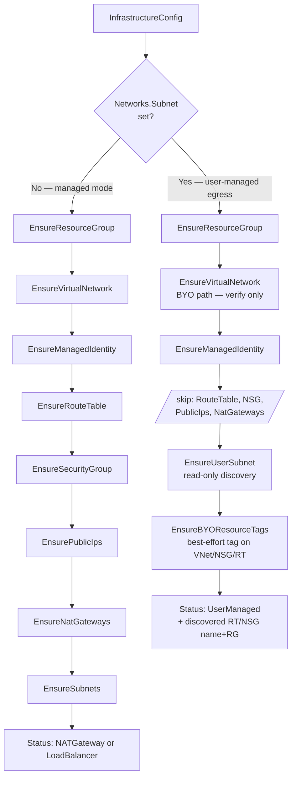

# User-Managed Egress via BYO Subnet

> **Companion document**: an implementation checklist derived from this proposal lives in [`flexible-network-configuration-spec.md`](./flexible-network-configuration-spec.md). This proposal is the source of truth for design intent and acceptance criteria; the spec captures the concrete file paths, code sketches, and testing surface a coding agent (or engineer) needs to implement it.

<!-- toc -->

- [Summary](#summary)
- [Motivation](#motivation)
  - [Goals](#goals)
  - [Non-Goals](#non-goals)
- [Background: today's egress in `provider-azure`](#background-todays-egress-in-provider-azure)
- [Background: Azure egress patterns](#background-azure-egress-patterns)
- [Proposal](#proposal)
  - [API changes](#api-changes)
  - [Derived mode](#derived-mode)
  - [Validation rules](#validation-rules)
  - [Reconciler behavior](#reconciler-behavior)
  - [Status shape](#status-shape)
  - [Cloud-provider config (`azure.json`)](#cloud-provider-config-azurejson)
  - [`allow-egress` dummy Services](#allow-egress-dummy-services)
  - [Route-controller and overlay-CNI opt-out](#route-controller-and-overlay-cni-opt-out)
  - [NSG mutation contract](#nsg-mutation-contract)
  - [Bastion](#bastion)
- [Configuration patterns](#configuration-patterns)
- [Migration and immutability](#migration-and-immutability)
- [User responsibilities](#user-responsibilities)
- [Deletion / teardown semantics](#deletion--teardown-semantics)
- [Documentation](#documentation)
- [Acceptance criteria](#acceptance-criteria)
- [Risks and upstream conflicts](#risks-and-upstream-conflicts)
- [Alternatives considered](#alternatives-considered)
- [Resolved questions](#resolved-questions)
- [Out of scope (future work)](#out-of-scope-future-work)

<!-- /toc -->

## Summary

Give shoot owners full control over Azure egress by allowing them to bring their own worker **subnet** — pre-attached to their own route table (typically with a `0.0.0.0/0` route to a firewall/NVA, or no default route at all for network-isolated clusters). In this mode Gardener's _infrastructure reconciler_ stops creating and managing the subnet, the route table, the NSG (as a resource), and the NAT Gateway, and stops deploying the LB-egress workaround Services. The user pre-provisions all of the above; Gardener only _discovers and references_ them.

Note that the NSG's `securityRules` collection is still mutated at runtime by the Azure CCM (for `Service type=LoadBalancer`) and by the bastion controller (for Bastion resources) — see [NSG mutation contract](#nsg-mutation-contract). This is unchanged from every other Gardener Azure shoot.

This covers two related egress topologies: (a) a user-owned route table with a `0.0.0.0/0` route to a firewall or virtual appliance, and (b) a user-owned subnet with no default route at all — for network-isolated shoots that terminate all traffic via Private Endpoints. Both are collapsed into a single "user-managed egress" Gardener mode signaled by the presence of a BYO subnet reference.

## Motivation

Today, `provider-azure` locks shoot owners into one of two outbound topologies:

1. NAT Gateway (with optional BYO public IPs), or
2. A Standard Load Balancer forced into existence by two synthetic `allow-{tcp,udp}-egress` `Service type=LoadBalancer` objects in `kube-system` — a workaround for Standard SLB's default-deny-outbound behavior (chart at `charts/internal/shoot-system-components/charts/allow-egress`).

Common enterprise requirements dictate additional options:

- **Central firewall egress** — send all `0.0.0.0/0` from workers to an Azure Firewall / third-party NVA sitting in a hub VNet. Requires a user-owned route table on the worker subnet with a `VirtualAppliance` next hop.
- **No egress at all** — network-isolated / air-gapped shoots that terminate all traffic via Private Endpoints; no public IP anywhere.
- **BYO subnet inside a BYO VNet** — many enterprises pre-provision every subnet through their platform team and hand the shoot owner a subnet ID.

### Goals

- Support the two "user-managed egress" topologies described in the Summary — firewall-based egress via a user-owned route table with a default route to a virtual appliance, and no-egress (network-isolated) shoots with no default route.
- Support **BYO subnet** in the single-subnet (non-zoned) layout, requiring BYO VNet.
- Skip creation of the route table, worker NSG, NAT Gateway, and the LB-egress dummy Services when the user has taken over egress.
- Zero breaking changes for existing shoots: opting in is purely additive.

### Non-Goals

- **No new `OutboundType` enum.** Per the design decision, mode is derived from BYO field presence.
- **No BYO subnet in the multi-subnet (zoned) layout** in v1. `Networks.Zones[i].Subnet` is deferred.
- **No BYO NAT Gateway** (the resource) in v1. Users needing a pre-existing NAT Gateway can attach it to their BYO subnet themselves; Gardener will not create or reference one in BYO-subnet mode.
- **No BYO Route Table as a separate API field.** The route table is discovered from the subnet's existing `RouteTable` association; the user attaches it out-of-band.
- **No BYO NSG as a separate API field.** The NSG is discovered from the subnet's existing `NetworkSecurityGroup` association (see rationale in `Validation rules`). Gardener's infrastructure reconciler does not create the NSG; the CCM and bastion controller still mutate its `securityRules` collection at runtime (see [NSG mutation contract](#nsg-mutation-contract)).

## Background: today's egress in `provider-azure`

- `InfrastructureConfig` API: `pkg/apis/azure/types_infrastructure.go`. BYO surface today = VNet (`VNet.Name`+`VNet.ResourceGroup`), user-assigned managed identity, DDoS plan, and public IPs consumed by a Gardener-managed NAT Gateway.
- Reconciler is flow-based: `pkg/controller/infrastructure/infraflow/flow_context.go:150-177`. Task graph creates RG → VNet → Identity → RouteTable → NSG → PublicIPs → NatGateways → Subnets. The route table (`worker_route_table`) is created **empty**; the seed-hosted CCM populates per-node pod-CIDR routes via `--configure-cloud-routes=true` (chart `charts/internal/seed-controlplane/charts/cloud-controller-manager/templates/cloud-controller-manager.yaml:48`).
- `cloud-provider-config` chart hard-codes `loadBalancerSku=standard` (`charts/internal/cloud-provider-config/templates/cloud-provider-config.tpl:12`). Neither `outboundType` nor `disableOutboundSNAT` is ever set.
- Egress via SLB works today only because of the two `allow-{tcp,udp}-egress` Services pinned into `kube-system` (deployment gated at `pkg/controller/controlplane/valuesprovider.go:766-771`; opt-out annotation `azure.provider.extensions.gardener.cloud/skip-allow-egress`).
- Existing derived status field `InfrastructureStatus.Networks.OutboundAccessType` currently takes `NATGateway` | `LoadBalancer`. This proposal adds a third value.

## Background: Azure egress patterns

Azure workloads inside a VNet can reach the internet through several distinct topologies. From the standpoint of the shoot's infrastructure, they are:

| Egress path                                                                     | Automation creates            | User provides                                             |
| ------------------------------------------------------------------------------- | ----------------------------- | --------------------------------------------------------- |
| Standard Load Balancer (frontend PIP + outbound rule)                           | LB + PIP + backend pool       | —                                                         |
| NAT Gateway (`Standard` or `StandardV2`, zone-redundant) attached to the subnet | NAT + PIP, attached to subnet | —                                                         |
| Pre-existing NAT Gateway attached to a pre-existing subnet                      | nothing                       | BYO VNet + subnet + NAT (attached to subnet)              |
| Route table on the subnet with a `0.0.0.0/0` route to a firewall / NVA          | nothing                       | BYO VNet + subnet + user route table with a default route |
| No egress infrastructure at all (network-isolated)                              | nothing                       | BYO VNet + subnet; no default route required              |

Critical fact confirmed from upstream `kubernetes-sigs/cloud-provider-azure` source: the CCM has **zero awareness of any high-level "outbound type" abstraction** — no such field is read from `azure.json`. The CCM only creates LB + PIP reactively for `Service type=LoadBalancer`, never proactively at startup. Any outbound-topology decisions must be made by whatever provisions the subnet, route table, NAT, and load balancer — i.e. Gardener's infrastructure reconciler. The only related knob the CCM does honor is `disableOutboundSNAT` (per-`LoadBalancingRule` flag; it should be set to `true` whenever the SLB is not the intended egress path).

Consequence for Gardener: implementing user-managed egress is entirely a matter of what Gardener chooses **not** to create at reconcile time, plus a small `azure.json` tweak (`disableOutboundSNAT: true`) plus deciding whether to skip the allow-egress dummy Services.

## Proposal

### API changes

Two additions on `InfrastructureConfig.Networks`:

1. **`Subnet` — an optional reference to an existing subnet inside the (also user-provided) VNet.** When set, Gardener switches into user-managed-egress mode. The reference carries only a subnet name, not a resource group — in ARM, a subnet is a child resource of its VNet, so the VNet's resource group (already available on `Networks.VNet.ResourceGroup`) plus VNet name plus subnet name uniquely identify it.
2. **`Subnet.SkipRouteReconciliation` — an optional boolean, default `false`.** When `true`, the seed CCM's route controller is disabled and Gardener does not require the BYO subnet to have a route table attached. Intended for shoots using an overlay CNI (Cilium/Calico with VXLAN or Geneve) where pod-CIDR routes are not needed in the underlying VNet.

No new mode/enum is added. Presence of `Networks.Subnet` alone signals user-managed-egress mode (see [Derived mode](#derived-mode)).

One status-only addition: the existing `OutboundAccessType` enum on `InfrastructureStatus.Networks` gains a third value **`UserManaged`**, set when the user brought their own subnet and did not enable a NAT Gateway. The API user does not set this; it is derived at reconcile time.

Concrete Go type definitions are in the companion spec document — see [`flexible-network-configuration-spec.md`](./flexible-network-configuration-spec.md).

### Derived mode

The mode is signaled solely by the presence of `Networks.Subnet`. No enum, no marker field, no annotation. The reconciler branches on `Networks.Subnet != nil`; the resulting status carries `OutboundAccessType=UserManaged` and downstream code (allow-egress gating, azure.json field emission, etc.) branches on the status value.

### Validation rules

Added in `pkg/apis/azure/validation/infrastructure.go`.

When `Networks.Subnet != nil`:

| Rule                                                                    | Rationale                                                                                                      |
| ----------------------------------------------------------------------- | -------------------------------------------------------------------------------------------------------------- |
| `Networks.VNet.Name` and `Networks.VNet.ResourceGroup` must both be set | User-managed egress requires a BYO VNet — Gardener cannot own the VNet if it doesn't own the subnet inside it. |
| `Networks.VNet.CIDR` must be unset                                      | BYO VNet — CIDR is discovered, not declared.                                                                   |
| `Networks.VNet.DDosProtectionPlanID` must be unset                      | BYO VNet — user manages the plan on their side.                                                                |
| `Networks.Workers` must be unset                                        | Workers CIDR is discovered from the actual subnet.                                                             |
| `Networks.Zones` must be empty                                          | Single-subnet layout only in v1.                                                                               |
| `Networks.NatGateway` must be nil                                       | Gardener does not manage a NAT in this mode; if the user wants one, they attach it to their subnet themselves. |
| `Networks.ServiceEndpoints` must be empty                               | User manages service endpoints on their own subnet.                                                            |
| `Networks.Subnet.Name` non-empty (RFC-1123-ish per Azure naming rules)  | Standard field validation.                                                                                     |

**Runtime validation** — a new pre-flight validator runs before reconcile and checks the referenced ARM resources actually exist and are compatible. It complements the API-level rules above; API-level rules catch static mistakes at admission time, runtime rules catch mismatches with the live cloud state:

| Rule                                                                                                           | Rationale                                                                                                                                                                                                                   |
| -------------------------------------------------------------------------------------------------------------- | --------------------------------------------------------------------------------------------------------------------------------------------------------------------------------------------------------------------------- |
| The referenced subnet must exist in the BYO VNet                                                               | Fail fast with a clear error.                                                                                                                                                                                               |
| The subnet must have a `RouteTable` association (`subnet.properties.routeTable.id != nil`), unless `Networks.Subnet.SkipRouteReconciliation=true` | The seed CCM runs the route controller by default and needs somewhere to write per-node pod-CIDR routes. Relaxed for overlay CNI shoots that opt out (see [Route-controller and overlay-CNI opt-out](#route-controller-and-overlay-cni-opt-out)).                                                                                                                                                                              |
| The subnet must have a `NetworkSecurityGroup` association (`subnet.properties.networkSecurityGroup.id != nil`) | Upstream CCM's `EnsureLoadBalancer` needs a non-empty `securityGroupName` in `azure.json` to program per-Service ingress rules for `Service type=LoadBalancer`.                                                             |
| The subnet's CIDR must be a subset of `shoot.spec.networking.nodes` and non-overlapping with pods/services     | Same rule that validates managed subnets today.                                                                                                                                                                             |
| The discovered route table and NSG must be in the same subscription as the shoot                               | Cross-subscription references aren't supported by CCM's `azure.json`. There is **no** cluster-RG-or-VNet-RG constraint: any RG in the subscription is fine (see [Cloud-provider config](#cloud-provider-config-azurejson)). |

**Immutability** (`ValidateInfrastructureConfigUpdate`):

- `Networks.Subnet.Name` is immutable once set.
- Transitioning to or from user-managed-egress mode after cluster creation is **forbidden** in v1 (i.e. `Networks.Subnet` cannot be added or removed on an existing shoot). Such a transition would recreate/delete route tables, NSGs, NAT gateways, and PIPs while workloads run — high operational blast radius (egress IPs change, connections drop). Deferred to a follow-up.

### Reconciler behavior

Modifications live in `pkg/controller/infrastructure/infraflow/`.

**Task-gating matrix**:

| Task                    | Condition                                                                                                                                |
| ----------------------- | ---------------------------------------------------------------------------------------------------------------------------------------- |
| `EnsureResourceGroup`   | unchanged                                                                                                                                |
| `EnsureVirtualNetwork`  | unchanged (BYO VNet path already exists)                                                                                                 |
| `EnsureManagedIdentity` | unchanged                                                                                                                                |
| `EnsureRouteTable`      | **skip if `IsUsingUserManagedEgress()`**                                                                                                 |
| `EnsureSecurityGroup`   | **skip if `IsUsingUserManagedEgress()`**                                                                                                 |
| `EnsurePublicIps`       | already naturally skipped (no NAT configured)                                                                                            |
| `EnsureNatGateways`     | already naturally skipped                                                                                                                |
| `EnsureSubnets`         | **new branch: `EnsureUserSubnet`** — verify existence, fetch RT + NSG IDs/names, populate whiteboard; do NOT patch any subnet properties |
| `EnsureBYOResourceTags` | **new, BYO-only** — best-effort tag add on VNet, NSG, RT (see [metadata-tags subsection below](#reconciler-behavior))                    |

The flow-level gating:



**New reconciler task** `EnsureUserSubnet` — active only in BYO mode. It:

1. Reads the referenced subnet from Azure.
2. Verifies the subnet exists in the BYO VNet, that its CIDR is compatible with the shoot's networking config, and that it has the required associations (NSG mandatory; route table mandatory unless `SkipRouteReconciliation=true`).
3. Parses the route table and NSG ARM IDs into `(resourceGroup, name)` pairs and stores them for status emission and `azure.json` rendering.
4. Never issues a `PUT`/`PATCH` on the subnet itself — the discovery is read-only.

**Metadata tags on the BYO resources.** For human observability, the reconciler adds a single tag to the BYO VNet, NSG, and route table:

```
kubernetes.io/cluster/<shoot-technical-name> = shared
```

Standard cloud-provider convention. `shared` signals that the resource is BYO (shared with the shoot, not owned by it). Multiple shoots on the same resource each add their own key. On shoot deletion, only this shoot's key is removed; other tags are untouched.

Tag operations are **best-effort**: if the Azure principal lacks tag-write permission on one of the three resources (e.g. under Azure Policy locking), the reconciler logs a warning and continues. Tags are informational only — no Gardener code reads them back for correctness.

Implementation: a new task `EnsureBYOResourceTags` runs after `EnsureUserSubnet` in the reconcile flow, and a corresponding `RemoveBYOResourceTags` runs in the delete flow. Both merge into the resource's existing tags (never replace) and only manage the one shoot-scoped key.

### Status shape

The `RouteTable` and `SecurityGroup` status types gain an optional `ResourceGroup` field — additive and backward-compatible (nil in existing managed shoots, where the resources live in the cluster RG by convention). Only populated in BYO-subnet mode, where the resources may live in any RG within the shoot's subscription.

`InfrastructureStatus.Networks` mapping in BYO-subnet mode:

| Status field                         | In BYO-subnet mode                                                                                           |
| ------------------------------------ | ------------------------------------------------------------------------------------------------------------ |
| `Networks.VNet.{Name,ResourceGroup}` | user-provided values, unchanged                                                                              |
| `Networks.Subnets[]`                 | one entry: `{Purpose: PurposeNodes, Name: <BYO subnet name>, Zone: nil, Migrated: false, NatGatewayID: nil}` |
| `Networks.Layout`                    | `SingleSubnet`                                                                                               |
| `Networks.OutboundAccessType`        | **new value** `UserManaged`                                                                                  |
| `RouteTables[]`                      | one entry with the discovered RT `Name` + `ResourceGroup`; **omitted entirely** if `SkipRouteReconciliation=true` and no RT is attached |
| `SecurityGroups[]`                   | one entry with the discovered NSG `Name` + `ResourceGroup`                                                   |
| `EgressCIDRs`                        | **nil** (Gardener has no knowledge of the user's egress IPs)                                                 |

The last point matters: today `shoot.status.provider.egressCIDRs` is populated from the NAT Gateway's public IPs. In user-managed egress mode, Gardener has no reliable way to know what IPs the user's firewall / NVA egresses through. Downstream consumers that rely on it must handle nil; document that reliably knowing egress IPs in this mode requires out-of-band information from the user.

### Cloud-provider config (`azure.json`)

Three concerns for how Gardener renders the shoot's `azure.json`:

1. **Existing fields already work.** `resourceGroup`, `vnetName`, `vnetResourceGroup`, `subnetName`, `routeTableName`, `securityGroupName` are already sourced from `InfrastructureStatus`; once the status is populated correctly in BYO mode, they pick up the discovered BYO values automatically.
2. **Resource-group overrides.** When the discovered NSG or route table lives in an RG other than the shoot's cluster RG, `azure.json` must additionally emit the upstream CCM fields `securityGroupResourceGroup` and `routeTableResourceGroup`. Both default to `resourceGroup` if unset, so today's managed-mode shoots remain unchanged. Emitting them lets the NSG and RT live in **any resource group in the same subscription** as the shoot — cluster RG, VNet RG, a central security-team RG.
3. **Outbound SNAT suppression.** When `OutboundAccessType == UserManaged`, `azure.json` sets `disableOutboundSNAT: true`. This is a cluster-wide instruction to the upstream CCM: every `Service type=LoadBalancer` reconcile will produce LB rules with `DisableOutboundSnat=true`, ensuring the LB frontend never becomes an accidental egress path bypassing the user's route table.

A fourth concern applies in the [route-controller opt-out](#route-controller-and-overlay-cni-opt-out) case: the seed-controlplane CCM's `--configure-cloud-routes` flag becomes `false`. This is a separate lever from `azure.json` — it's a CCM command-line flag rendered by the seed-controlplane chart.

### `allow-egress` dummy Services

The gating in `deployAllowEgressChart` is extended: the two dummy Services are deployed only when `OutboundAccessType == LoadBalancer`. In `UserManaged` mode they are skipped. In `NATGateway` mode they were already skipped by the existing logic. The pre-existing `skip-allow-egress` shoot annotation still overrides the gating for advanced LB-mode users who want to manage egress themselves.

### Route-controller and overlay-CNI opt-out

There are two operating modes for pod-CIDR routing on Azure:

**Default (route-controller enabled)** — the seed CCM runs with `--configure-cloud-routes=true` and writes per-node pod-CIDR routes into the route table associated with the worker subnet. This is what today's shoots do; it matches the historic kubenet-style routing model. In BYO-subnet mode the CCM writes those routes into the user's route table, which has three implications the user must accept:

1. The user must not run competing automation (Terraform / policy engines) against the route table that reverts CCM's per-node routes.
2. Every node created by MCM results in a new route in the route table. Very large clusters may approach the Azure route-table limit (400 routes per table, extensible to 1000 via a support case).
3. The user's default route (`0.0.0.0/0` to firewall / NVA) coexists peacefully with per-node routes because the per-node routes are more specific (pod CIDR /24). No conflict.

**Overlay-CNI (route-controller disabled)** — shoots using an overlay CNI (Cilium with VXLAN or Geneve, Calico with VXLAN, etc.) do not need pod-CIDR routes in the underlying VNet: pod-to-pod traffic is encapsulated at the node level. For those shoots Gardener should be able to leave the user's route table completely untouched.

The proposal introduces an opt-out signal that turns the route controller off:

- A new optional field, `Networks.Subnet.SkipRouteReconciliation *bool` (default `false` — preserves today's behavior).
- When `true`, the seed CCM runs with `--configure-cloud-routes=false` and the reconciler does not require the BYO subnet to have a route table attached at all. If a route table is attached, Gardener still discovers and references it in `azure.json` (for consistency and for the CCM's LB code paths that read route-table state), but no per-node routes are written.
- Validation adjusts accordingly: the "subnet must have a `RouteTable` association" rule from [Validation rules](#validation-rules) is relaxed when `SkipRouteReconciliation=true`.

The user takes ownership of using an overlay CNI. Gardener does not introspect the shoot's `networking.type` or the CNI's configuration to auto-derive this — the field is an explicit opt-in with clear semantics, and misconfiguration (setting it `true` while using a non-overlay CNI) is the user's responsibility.

### NSG mutation contract

**What the infrastructure reconciler does in BYO-subnet mode**: nothing. It does not create the NSG resource, does not set base rules on it, does not touch its tags, does not delete it on shoot deletion. The NSG is only _discovered_ (via the BYO subnet's `.properties.networkSecurityGroup.id` reference) and its name and resource group are written into `azure.json`.

**What the Azure CCM does to the NSG at runtime** — implemented in upstream `reconcileSecurityGroup` at `pkg/provider/azure_loadbalancer.go:3401`, invoked from `EnsureLoadBalancer` (`:163`) and `EnsureLoadBalancerDeleted` (`:482`). For each `Service type=LoadBalancer` reconcile:

| Step | Operation                                     | Upstream ref | When                                                               | Effect on NSG                                                                                                                                                                    |
| ---- | --------------------------------------------- | ------------ | ------------------------------------------------------------------ | -------------------------------------------------------------------------------------------------------------------------------------------------------------------------------- |
| 1    | `nsgRepo.GetSecurityGroup(ctx)`               | `:3424`      | always                                                             | Read-only: `GET` on the NSG in `securityGroupResourceGroup` (or falls back to `resourceGroup`).                                                                                  |
| 2    | `accessControl.CleanSecurityGroup(...)`       | `:3491`      | Service delete only                                                | Drops the rules previously added for this Service (name-matched by Service hash).                                                                                                |
| 3    | `accessControl.PatchSecurityGroup(...)`       | `:3498`      | Service create/update, iff `!disableLoadBalancerNSGRule` (`:3497`) | Adds allow-rule: source = `Internet` service tag or `spec.loadBalancerSourceRanges`; destination = LB frontend IPs (or backend IPs if `disableFloatingIP`); port = Service port. |
| 4    | `accessControl.RetainSecurityGroup(...)`      | `:3520`      | Service create/update                                              | Sweeps stale CCM-authored rules whose target destinations no longer exist. **No-op if no CCM-authored rules present.**                                                           |
| 5    | `ensureSecurityGroupTagged(rv)`               | `:3532`      | always                                                             | Adds cluster tags to the NSG iff `az.Tags`/`az.TagsMap` are set. **No-op for Gardener** — Gardener does not populate `Tags`/`TagsMap` in `cloud-provider-config`.                |
| 6    | `nsgRepo.CreateOrUpdateSecurityGroup(ctx,rv)` | `:3539`      | if steps 2–5 mutated the NSG                                       | Writes the updated NSG back to ARM.                                                                                                                                              |

**What the bastion controller does to the NSG**: for each Bastion resource lifecycle, adds/removes 4 IP-scoped rules on the same NSG — 2 SSH-in from operator CIDRs, 1 SSH-out to worker CIDRs, and 1 deny-all-out that ensures the bastion has no internet egress. Rule names are prefixed `<bastion-instance-name>-` and removed on Bastion delete.

Both flows are additive, name-scoped, and self-cleaning. They never touch the user's non-Gardener rules.

**Escape hatch for CCM NSG mutation** — the annotation `service.beta.kubernetes.io/azure-disable-load-balancer-nsg-rule: "true"` on a `Service type=LoadBalancer`:

- Skips step 3 (`PatchSecurityGroup`) — no rules added for that Service.
- Steps 4, 5, 6 still run, but each is a no-op when nothing has been added:
  - `RetainSecurityGroup` only removes stale CCM-authored rules; if we never added any, none to remove.
  - `ensureSecurityGroupTagged` is already a no-op for Gardener.
  - `CreateOrUpdateSecurityGroup` is only invoked if steps 2–5 mutated the NSG.
- If **every** LB Service in the shoot carries the annotation, the CCM's NSG interaction becomes read-only (one `GET` per reconcile; zero writes).

There is no cluster-wide upstream equivalent. If we later want to force this cluster-wide (e.g. for shoots whose NSGs are hard-locked by Azure Policy), a mutating webhook that stamps the annotation on every LB Service would suffice — deferred as future work.

**Permission implication**: Gardener's Azure principal must have `Microsoft.Network/networkSecurityGroups/securityRules/*` (or equivalent role) on the NSG's resource group — whichever RG that turns out to be. In BYO setups where the NSG lives in a security-team-owned RG with read-only permissions for the shoot principal, LB Services and Bastion will fail at reconcile time. This is a user-facing prerequisite.

### Bastion

Bastion is **fully supported** in BYO-subnet mode. No new API surface is required.

The bastion controller already reads the worker subnet from `InfrastructureStatus.Networks.Subnets[0]` and looks it up in the VNet's resource group when the VNet is BYO. The one small change: the NSG name is currently derived by a hard-coded naming convention; it must instead be sourced from `InfrastructureStatus.SecurityGroups[0]` so that bastion picks up the discovered BYO NSG in this mode and the managed `<clusterName>-workers` NSG otherwise. This is a refactor internal to the bastion controller, not an API change.

**Bastion's NSG mutation footprint** — four IP-scoped rules per bastion (see [NSG mutation contract](#nsg-mutation-contract)). The bastion has no internet egress by design (its own NSG rules include a deny-all-outbound), so no firewall allowlisting is required on the user's side for bastion egress.

**Bastion resource placement**: VM, disk, NIC, and the bastion's public IP are created in the shoot's cluster RG (unchanged). The NIC lives inside the BYO worker subnet. NSG rules land on the discovered BYO NSG, wherever it lives in the subscription.

Bastion works if and only if Gardener's principal can write NSG rules on the discovered NSG's resource group. Users who lock down NSG mutation (e.g. via Azure Policy) can simply not create Bastion resources; there is no cost when unused.

## Configuration patterns

### Pattern 1 — Firewall-based egress

```yaml
apiVersion: azure.provider.extensions.gardener.cloud/v1alpha1
kind: InfrastructureConfig
zoned: true
networks:
  vnet:
    name: hub-spoke-workers-vnet
    resourceGroup: platform-network-rg
  subnet:
    name: shoot-a-workers
```

User pre-provisions:

- The VNet `hub-spoke-workers-vnet` in `platform-network-rg`.
- A subnet `shoot-a-workers` inside that VNet.
- A route table attached to the subnet with a `0.0.0.0/0` route pointing to their Azure Firewall / NVA (next-hop = `VirtualAppliance` + firewall IP).
- An NSG attached to the subnet.
- Any firewall rules needed to reach the Azure endpoints required for a Kubernetes cluster to function — at minimum the `AzureCloud` service tag (ARM, IMDS, storage), the `AzureContainerRegistry` service tag, and the public MCR endpoint (`mcr.microsoft.com` and its CDN backends).

Gardener will:

- Verify all of the above exists.
- Skip creating a route table, NSG (as a resource), NAT, LB, or allow-egress services.
- Discover the RT and NSG associations from the subnet at reconcile time and emit `cloud-provider-config` with `subnetName`, `routeTableName`, `securityGroupName`, `vnetResourceGroup` all populated from the BYO resources, plus `disableOutboundSNAT: true`.
- Continue to allow the CCM and bastion controller to add/remove narrowly-scoped rules on the discovered NSG at runtime (see [NSG mutation contract](#nsg-mutation-contract)).

### Pattern 2 — No egress (network-isolated)

Identical `InfrastructureConfig` to Pattern 1. The user simply doesn't put a `0.0.0.0/0` route in their route table. Gardener cannot and does not validate the absence — that's the user's choice.

Prerequisites for this to actually work as a cluster:

- Private Endpoints for the API server (Gardener's private-cluster feature).
- Private Endpoints or Service Endpoints for any Azure services the workload needs.
- No dependency on public MCR, no dependency on public NTP, etc.

Documented as a supported topology; the user takes ownership of making the cluster viable.

### Pattern 3 — Managed VNet + managed NAT + managed subnet (unchanged)

Today's default. `Networks.Subnet` unset. Everything works exactly as before. Zero migration required for existing shoots.

## Migration and immutability

- **Existing shoots** keep working. `Networks.Subnet` is `+optional`.
- **New shoots** may opt in at creation time. Opting in requires setting `Networks.VNet.{Name,ResourceGroup}` (already supported).
- **In-place transition**: forbidden in v1. Once created with `Networks.Subnet` set, it must stay set; once created without, it must stay unset. Enforced in `ValidateInfrastructureConfigUpdate` at `pkg/apis/azure/validation/infrastructure.go:469-513`. Rationale: transitioning between managed and user-managed egress mid-flight means recreating/deleting the route table + NSG + NAT + PIPs while workloads are running — disruptive, error-prone, and unnecessary for the initial delivery. Users who need to migrate can create a fresh shoot.
- **`Networks.Subnet.Name` immutable** once set.

## User responsibilities

Explicitly documented in `docs/usage/`:

The user MUST provide, before shoot creation:

1. A VNet.
2. A subnet inside that VNet, whose CIDR fits inside `shoot.spec.networking.nodes` and does not overlap `shoot.spec.networking.{pods,services}`.
3. A **route table** attached to that subnet. For firewall-based egress usage, this route table should contain a `0.0.0.0/0` route to the user's firewall / NVA. For network-isolated usage, it may be empty (Gardener will still write pod-CIDR routes into it).
4. A **network security group** attached to that subnet, permitting at minimum:
   - Intra-subnet traffic (for pod-to-pod and node-to-node).
   - Inbound from `AzureLoadBalancer` (Azure service tag) for health probes.
5. Any firewall rules required for Azure control-plane traffic and container image pulls.
6. Route table and NSG must be in the same Azure subscription as the shoot; they may live in any RG within that subscription.
7. Gardener's Azure principal must have write permission on the NSG's resource group (`Microsoft.Network/networkSecurityGroups/securityRules/write`) — the CCM adds/removes rules per `Service type=LoadBalancer` lifecycle, and the bastion controller adds/removes rules per Bastion resource lifecycle. See [NSG mutation contract](#nsg-mutation-contract).
8. (Optional, non-blocking) For observability tags to appear on the VNet, NSG, and route table, Gardener's Azure principal needs `Microsoft.Network/virtualNetworks/write`, `Microsoft.Network/networkSecurityGroups/write`, and `Microsoft.Network/routeTables/write` on the corresponding RGs. If any of these are denied, tagging is silently skipped for that resource — the shoot still reconciles green.

The user MUST NOT:

- Run competing automation against the discovered route table (CCM writes per-node pod-CIDR routes there).
- Run competing automation against the discovered NSG (CCM and bastion controller add/remove named, scoped rules there; strict NSG policy engines will fight this).
- Rely on `shoot.status.provider.egressCIDRs` for firewall allowlisting on the receiving side — this field is empty in user-managed egress mode.

## Deletion / teardown semantics

- BYO subnet is **never** deleted by Gardener.
- BYO VNet is **never** deleted by Gardener (already the case today).
- BYO route table and NSG are **never** deleted by Gardener.
- The observability tag `kubernetes.io/cluster/<shoot-technical-name>: shared` that the reconciler added to the BYO VNet, NSG, and route table is removed on shoot deletion by the `RemoveBYOResourceTags` task. Tag removal is best-effort — a failure (e.g. permission revoked, resource already gone) logs a warning and does not block deletion. Other tags on the resource are untouched.
- Named rules added by the CCM (for LB Services) and the bastion controller (for Bastion resources) on the NSG are cleaned up on their owning resource's delete — same as for any Gardener Azure shoot today. On shoot deletion, all LB Services and all Bastion resources are deleted first, which triggers the corresponding NSG rule removal before Gardener stops managing anything.
- Any load balancers created by CCM for `Service type=LoadBalancer` are cleaned up by the existing LB-in-foreign-VNet-RG cleanup path, which already handles the BYO-VNet case today.

## Documentation

Two documents added:

1. `docs/usage/user-managed-egress.md` — end-user how-to with:
   - Step-by-step Azure CLI / portal instructions to pre-provision VNet + subnet + RT + NSG.
   - Example route table configurations for firewall-based egress.
   - Discussion of the network-isolated variant (no default route) and its cluster-viability prerequisites (private API server, Private Endpoints for MCR, etc.).
   - The list of Azure endpoints that the cluster needs to reach (control plane, container registries, etc.), cross-linked to Microsoft's authoritative outbound-rules documentation.
   - Explicit warning that `shoot.status.provider.egressCIDRs` will be empty.
2. `docs/usage/usage.md` — new subsection under the existing "Networking" section, cross-linking to (1).

## Acceptance criteria

Any implementation must pass the following scenarios end-to-end. They are grouped into regression scenarios (existing behavior must not change), new BYO-mode scenarios that must succeed, validation scenarios that must fail with clear errors, immutability scenarios, and runtime-behavior scenarios. Each scenario states its pre-conditions and its observable pass criteria.

### Group A — Regression (existing behavior unchanged)

| ID  | Configuration                                                                                     | Pass criteria                                                                                                                                                                                                                                  |
| --- | ------------------------------------------------------------------------------------------------- | ---------------------------------------------------------------------------------------------------------------------------------------------------------------------------------------------------------------------------------------------- |
| A1  | Managed VNet + managed subnet, no `NatGateway`                                                    | Shoot reconciles green; `worker_route_table` created; `<technicalName>-workers` NSG created; two `allow-{tcp,udp}-egress` Services present in `kube-system`; `azure.json` has no `disableOutboundSNAT`; egress functional via LB frontend PIP. |
| A2  | Managed VNet + managed subnet + `NatGateway.Enabled=true`                                         | Shoot reconciles green; NAT Gateway created; no `allow-egress` Services; `InfrastructureStatus.EgressCIDRs` populated with NAT PIP `/32` entries; egress functional via NAT PIP.                                                               |
| A3  | BYO VNet (`Networks.VNet.{Name,ResourceGroup}` set) + managed subnet + NAT with `IPAddresses` set | Shoot reconciles green; NAT uses user's public IPs (no new PIP created); user's VNet unmodified except for Gardener's subnet/RT/NSG lifecycle.                                                                                                 |
| A4  | Multi-zone managed subnet layout (`Networks.Zones[]` non-empty)                                   | Shoot reconciles green; one subnet + one NAT (if enabled) per zone; per-zone NSG rules and route tables.                                                                                                                                       |
| A5  | Existing single-subnet shoot migrated to multi-subnet layout                                      | Migration webhook stamps the `migration.azure.provider.extensions.gardener.cloud/zone` annotation; reconcile succeeds; no data-plane disruption.                                                                                               |

### Group B — Valid new BYO configurations (must reconcile green)

| ID  | Configuration                                                                                                     | Pass criteria                                                                                                                                                                                                                                                                                          |
| --- | ----------------------------------------------------------------------------------------------------------------- | ------------------------------------------------------------------------------------------------------------------------------------------------------------------------------------------------------------------------------------------------------------------------------------------------------ |
| B1  | BYO VNet in RG `hub-network`; BYO subnet with NSG in `hub-network` and RT in `hub-network` (co-located)           | Shoot reconciles green. `azure.json` contains `subnetName`, `routeTableName`, `securityGroupName`, `vnetResourceGroup=hub-network`, `disableOutboundSNAT: true`. Neither `securityGroupResourceGroup` nor `routeTableResourceGroup` emitted (defaults suffice via `vnetResourceGroup`… but see B2/B3). |
| B2  | BYO VNet in `hub-network`; NSG in `central-security-rg`; RT in `hub-network`                                      | `azure.json` emits `securityGroupResourceGroup: central-security-rg`. Reconcile green.                                                                                                                                                                                                                 |
| B3  | BYO VNet in `hub-network`; NSG and RT both in `network-team-rg` (a third RG, neither cluster nor VNet)            | `azure.json` emits both `securityGroupResourceGroup: network-team-rg` and `routeTableResourceGroup: network-team-rg`. Reconcile green.                                                                                                                                                                 |
| B4  | BYO subnet with a route table whose `0.0.0.0/0` route points at an Azure Firewall (next-hop = `VirtualAppliance`) | Egress from worker nodes flows via the firewall. Per-node pod-CIDR routes appear in the user's RT (written by the seed CCM's route controller). The user's `0.0.0.0/0` route is preserved.                                                                                                             |
| B5  | BYO subnet with an empty route table (no `0.0.0.0/0`)                                                             | Shoot reconciles green. Workers can reach in-VNet resources. Internet egress fails (expected; this is the "no egress" pattern). Per-node pod-CIDR routes still appear in the RT.                                                                                                                       |

### Group C — Rejected configurations (must fail validation with a clear error)

| ID  | Configuration                                                                     | Pass criteria                                                                             |
| --- | --------------------------------------------------------------------------------- | ----------------------------------------------------------------------------------------- |
| C1  | `Networks.Subnet` set, but `Networks.VNet.ResourceGroup` unset                    | API validation rejects: BYO subnet requires BYO VNet.                                     |
| C2  | `Networks.Subnet` set + `Networks.Zones` non-empty                                | API validation rejects: multi-subnet layout not supported with BYO subnet in v1.          |
| C3  | `Networks.Subnet` set + `Networks.Workers` non-empty                              | API validation rejects: workers CIDR is discovered, not declared, in BYO mode.            |
| C4  | `Networks.Subnet` set + `Networks.NatGateway` non-nil (any variant)               | API validation rejects: NAT is user-managed in BYO mode.                                  |
| C5  | `Networks.Subnet` set + `Networks.ServiceEndpoints` non-empty                     | API validation rejects: service endpoints managed by user in BYO mode.                    |
| C6  | `Networks.Subnet` set + `Networks.VNet.CIDR` set                                  | API validation rejects: CIDR is discovered from the actual VNet.                          |
| C7  | `Networks.Subnet` set + `Networks.VNet.DDosProtectionPlanID` set                  | API validation rejects: DDoS plan managed by user on BYO VNet.                            |
| C8  | `Networks.Subnet.Name` refers to a subnet that does not exist inside the BYO VNet | Pre-flight (runtime) validator rejects with error containing subnet name + VNet identity. |
| C9  | Referenced subnet has no `NetworkSecurityGroup` association                       | Pre-flight validator rejects: NSG must be pre-attached to the BYO subnet.                 |
| C10 | Referenced subnet has no `RouteTable` association                                 | Pre-flight validator rejects: route table must be pre-attached to the BYO subnet.         |
| C11 | Referenced subnet's CIDR is not a subset of `shoot.spec.networking.nodes`         | Pre-flight validator rejects.                                                             |
| C12 | Referenced subnet's CIDR overlaps `shoot.spec.networking.pods` or `.services`     | Pre-flight validator rejects.                                                             |
| C13 | Referenced NSG or RT lives in a different Azure subscription than the shoot       | Pre-flight validator rejects (cross-subscription references unsupported by CCM).          |

### Group D — Update / immutability

| ID  | Change on an existing shoot                                                  | Pass criteria                                                         |
| --- | ---------------------------------------------------------------------------- | --------------------------------------------------------------------- |
| D1  | Managed-mode shoot: attempt to add `Networks.Subnet` on update               | API validation rejects: mode transitions forbidden in v1.             |
| D2  | User-managed-egress shoot: attempt to remove `Networks.Subnet` on update     | API validation rejects.                                               |
| D3  | User-managed-egress shoot: change `Networks.Subnet.Name`                     | API validation rejects: `Networks.Subnet.Name` is immutable once set. |
| D4  | User-managed-egress shoot: change any BYO field on `Networks.VNet` (name/RG) | API validation rejects (existing VNet immutability rules apply).      |

### Group E — Runtime behavior (invariants after successful reconcile in BYO mode)

| ID  | Assertion                                                                                                                                                                                                                                                                                                                    |
| --- | ---------------------------------------------------------------------------------------------------------------------------------------------------------------------------------------------------------------------------------------------------------------------------------------------------------------------------- |
| E1  | `InfrastructureStatus.Networks.OutboundAccessType == UserManaged`.                                                                                                                                                                                                                                                           |
| E2  | `InfrastructureStatus.Networks.EgressCIDRs` is nil (or empty).                                                                                                                                                                                                                                                               |
| E3  | The reconciler makes zero `PUT`/`PATCH` calls against the BYO subnet, BYO NSG, BYO route table, or BYO VNet during reconcile (verified via ARM audit log or mock client assertions).                                                                                                                                         |
| E4  | The `worker_route_table` name does not appear in the shoot's cluster RG.                                                                                                                                                                                                                                                     |
| E5  | The `<technicalName>-workers` NSG name does not appear in the shoot's cluster RG.                                                                                                                                                                                                                                            |
| E6  | The `allow-tcp-egress` and `allow-udp-egress` Services are **not** present in `kube-system` of the shoot cluster.                                                                                                                                                                                                            |
| E7  | The `azure.json` emitted to the CCM contains, at minimum: `subnetName`, `routeTableName`, `securityGroupName`, `vnetResourceGroup`, `disableOutboundSNAT: true`. If NSG/RT live outside the VNet RG, the corresponding `securityGroupResourceGroup` / `routeTableResourceGroup` fields are also emitted with correct values. |
| E8  | Creating a `Service type=LoadBalancer` (default settings) → CCM creates SLB + Public IP; adds NSG rules on the discovered BYO NSG (in whichever RG it lives); LB rule has `disableOutboundSnat=true`.                                                                                                                        |
| E9  | Creating a `Service type=LoadBalancer` with annotation `service.beta.kubernetes.io/azure-disable-load-balancer-nsg-rule: "true"` → CCM creates SLB but adds **no** NSG rules; the user's NSG is untouched.                                                                                                                   |
| E10 | Deleting the `Service type=LoadBalancer` → CCM removes SLB, Public IP, and any NSG rules it added.                                                                                                                                                                                                                           |
| E11 | Creating a `Bastion` resource → 4 rules named `<bastion-instance-name>-*` appear in the BYO NSG; a bastion VM appears in the shoot's cluster RG with its NIC in the BYO subnet; bastion has no internet egress by design.                                                                                                    |
| E12 | Deleting the `Bastion` resource → all 4 rules are removed from the BYO NSG; bastion VM/NIC/PIP/Disk removed from cluster RG.                                                                                                                                                                                                 |

### Group F — Deletion / teardown

| ID  | Action                                                                                    | Pass criteria                                                                                                                                                                                                                                                                                        |
| --- | ----------------------------------------------------------------------------------------- | ---------------------------------------------------------------------------------------------------------------------------------------------------------------------------------------------------------------------------------------------------------------------------------------------------- |
| F1  | Delete the shoot                                                                          | The cluster RG is deleted (all Gardener-owned resources with it). The BYO VNet, subnet, RT, and NSG remain in their respective user-owned RGs unchanged. The `kubernetes.io/cluster/<technicalName>: shared` tag is removed from the VNet, NSG, and RT. Other tags on those resources are unchanged. |
| F2  | Delete the shoot while a `Service type=LoadBalancer` and a `Bastion` resource still exist | CCM/bastion controller remove their respective NSG rules before Gardener stops managing. After deletion, the BYO NSG contains none of the Gardener-added rules (verified by name-prefix match: no rule named `<bastion-*>-*` remaining and no CCM-hashed rules referencing the deleted LB).          |
| F3  | Delete the shoot in a VNet where other shoots or workloads share the BYO subnet           | The BYO subnet, its RT, and its NSG remain functional for the other consumers. Only the deleted shoot's cluster RG resources go away. Other shoots' `kubernetes.io/cluster/*` tags on the shared resources are preserved.                                                                            |
| F4  | Delete the shoot when tag-write permission on the VNet/NSG/RT has been revoked mid-life   | Tag removal fails; a warning is logged; shoot deletion completes successfully. Stale `kubernetes.io/cluster/<technicalName>` tags on the resources are the user's responsibility to clean up out-of-band.                                                                                            |

### Group G — Metadata tagging

| ID  | Action / Configuration                                                                                   | Pass criteria                                                                                                                                                                              |
| --- | -------------------------------------------------------------------------------------------------------- | ------------------------------------------------------------------------------------------------------------------------------------------------------------------------------------------ |
| G1  | Create a BYO shoot with tag-write permission on all three resources                                      | After reconcile, the BYO VNet, NSG, and RT each carry the tag `kubernetes.io/cluster/<technicalName>: shared`. Any pre-existing tags on those resources are preserved.                     |
| G2  | Create a second BYO shoot sharing the same BYO subnet (different technicalName)                          | Both shoots' tags coexist on the shared resources: `kubernetes.io/cluster/<shootA>: shared` AND `kubernetes.io/cluster/<shootB>: shared`. Neither shoot's tags interfere with the other's. |
| G3  | Create a BYO shoot where the Azure principal lacks `Microsoft.Network/virtualNetworks/write` on the VNet | Shoot still reconciles green. The VNet is not tagged. NSG and RT still get tagged (if permission is present). A warning is logged for the VNet tag failure.                                |
| G4  | Create a BYO shoot where the principal lacks tag-write on ALL three resources                            | Shoot still reconciles green. No tags are added. Three warnings are logged.                                                                                                                |
| G5  | Re-reconcile an existing BYO shoot (nothing changed)                                                     | Tag operations are idempotent — no ARM writes are made if the correct tag is already present.                                                                                              |

## Risks and upstream conflicts

Design-level concerns identified during investigation of the upstream Azure cloud-controller-manager and of the operational surface this proposal exposes. Listed roughly in decreasing severity. Anything here that is not addressed in this proposal is called out explicitly as "accepted risk" or "user responsibility".

| # | Category                | Concern                                                                                                                                                                                                                                                                                                                                                                          | Mitigation / stance                                                                                                                                                                                                                                                                                                          |
| - | ----------------------- | -------------------------------------------------------------------------------------------------------------------------------------------------------------------------------------------------------------------------------------------------------------------------------------------------------------------------------------------------------------------------------- | ---------------------------------------------------------------------------------------------------------------------------------------------------------------------------------------------------------------------------------------------------------------------------------------------------------------------------- |
| 1 | Shared-chart regression | Making `--configure-cloud-routes` values-driven in `charts/internal/seed-controlplane/charts/cloud-controller-manager` affects every Azure shoot on the seed. If the default is not preserved as `true`, existing managed-mode shoots silently stop programming pod-CIDR routes and node-to-pod connectivity breaks.                                                             | Default the values-key to `true`. Acceptance criteria A1 and A2 verify managed-mode behavior. Ship the chart change as an isolated commit with explicit regression testing before wiring it up to the new API field.                                                                                                          |
| 2 | Cross-subscription BYO  | Users with hub/spoke topologies that put the VNet in a "networking" subscription and workers in a "workload" subscription cannot use this design. The Azure CCM's `azure.json` is auth-scoped to one subscription; there is no field for resolving the NSG or RT in a different subscription.                                                                                    | **Not addressed in v1**. Documented as a user prerequisite (single-subscription BYO). Runtime validator rejects cross-subscription references (`C13`). If demand emerges, a follow-up can introduce a secondary-credential mechanism, but this is a substantial extension well beyond the current scope.                     |
| 3 | Silent-failure UX       | `disableOutboundSNAT: true` in `azure.json` makes CCM-created LB rules ingress-only. A user who expects `Service type=LoadBalancer` to also SNAT node egress (as it does today in Gardener's LB-egress workaround mode) will find their pods have no working egress path via the LB. Debugging is non-obvious because the LB reports healthy and rules exist — they just don't SNAT. | Documented under [Configuration patterns](#configuration-patterns) and [User responsibilities](#user-responsibilities). Consider surfacing a status condition on the shoot when `OutboundAccessType==UserManaged` to make the mode obvious to operators. Accepted risk in v1.                                                 |
| 4 | NSG rule priority       | The bastion controller writes ingress rules at priority `400`; the Azure CCM auto-assigns priorities for LB Service rules starting around `500`. If the user's pre-existing NSG already contains rules at those priorities, additions fail with an Azure API error and cascade to Bastion / LB Service reconcile-loop failures.                                                    | Accepted risk; documented as a user prerequisite. Users bringing an NSG shared with other workloads must leave the standard cloud-provider priority range free. A future enhancement could allow the bastion controller to negotiate an unused priority.                                                                     |
| 5 | NSG rule-count cap      | Azure NSGs have a soft cap of 1000 rules. A single BYO NSG shared across multiple shoots with many LB Services and bastions can approach this cap over time. Hitting the cap makes new LB Services and bastions fail with a hard Azure API error.                                                                                                                                 | Documented as a scalability boundary. Users on very high-density shared-NSG setups should provision one NSG per shoot. Not enforced by validation — the failure at the Azure API is clear enough.                                                                                                                            |
| 6 | Platform default drift  | Azure's ongoing retirement of default outbound access means new subnets created in 2025+ get `defaultOutboundAccess=false`. For network-isolated mode this is the intended state; for firewall-egress mode the user still needs their `0.0.0.0/0` route configured — if they miss it, there is no fallback egress at all. Not a bug in this design; a change in the platform default. | Documented in [User responsibilities](#user-responsibilities). Runtime validator does not check the subnet's `defaultOutboundAccess` state or the route table's contents; the user takes ownership.                                                                                                                          |
| 7 | Retry storm             | If Gardener's Azure principal loses NSG write permission on a shoot in flight (Policy change, IAM revocation), both the CCM's `Service type=LoadBalancer` reconcile loop and the extension's Bastion reconcile loop enter retry-with-backoff against ARM indefinitely. Noisy at the API level; user sees a stream of confusing reconcile-failed statuses.                             | Accepted; matches the existing behavior when any Gardener component loses permission. Users are advised to gate permission changes through a controlled change-management flow.                                                                                                                                                |
| 8 | Upstream CCM versioning | `securityGroupResourceGroup`, `routeTableResourceGroup`, and `disableOutboundSNAT` are all long-standing fields in `kubernetes-sigs/cloud-provider-azure`. If Gardener supports a CCM version that predates any of them, that field is silently ignored and BYO breaks (NSG lookup falls back to the cluster RG, egress SNAT falls back to enabled, etc.).                             | Verify the fields exist in every CCM version Gardener ships across its supported Kubernetes minor versions before merging. Add a compile-time or start-up sanity check if practical.                                                                                                                                          |

## Alternatives considered

### 1. Explicit `OutboundType` enum

Add `Networks.OutboundType: string` with values `loadBalancer` / `managedNATGateway` / `userAssignedNATGateway` / `userDefinedRouting` / `none`. Best diagnostics, best future compatibility for later additions such as `block` / `managedNATGatewayV2` / a true `userAssignedNATGateway`.

**Rejected in favor of derived mode** because:

- We're currently scoping only to UDR+None (collapsed). A five-value enum where four values are "TBD" is worse than no enum.
- Consistency across Gardener providers is preferred; other providers derive similar modes from field presence rather than exposing enums.
- If we later want the enum, we can add it as a status-only field derived from the same inputs (a "computed outbound type" for observability) without changing the input surface.

### 2. Reuse the two `OutboundAccessType` status values

Instead of adding `UserManaged`, reuse `LoadBalancer` and let downstream code differentiate via `Networks.Subnet != nil`.

**Rejected** because `OutboundAccessType` is a widely-consumed status signal; conflating "user-managed" with "we deployed the allow-egress LB workaround" would silently break dashboards, alerts, and monitoring queries that key off it.

### 3. BYO Route Table / BYO NSG as separate top-level fields

Add `Networks.RouteTable.{Name,ResourceGroup}` and `Networks.SecurityGroup.{Name,ResourceGroup}` alongside `Networks.Subnet`, letting users mix-and-match.

**Rejected** because in Azure, RT and NSG are _attached to_ a subnet. If the user brings a subnet, they've already made the RT and NSG choice at the ARM level. Discovering them from the subnet is unambiguous and produces less API surface / less validation. If a future use case needs "managed subnet with BYO route table" we can add it then.

### 4. Programmatically detect and preserve foreign-RG resources (extend the existing heuristic)

The existing preservation heuristic in the infrastructure reconciler already leaves foreign-RG NAT associations alone. Extend the same approach to RT and NSG, making BYO implicit.

**Rejected**: implicit behavior with no API surface is impossible to validate, document, or reason about. Users need an explicit way to say "I own this."

### 5. Support BYO in the zoned (multi-subnet) layout too

Add `Networks.Zones[i].Subnet` as a per-zone BYO subnet reference to support the multi-subnet (zoned) layout.

**Rejected for v1** per design decision. Deferred. The single-subnet layout covers the vast majority of user-managed-egress use cases (a hub-spoke topology with one worker subnet is the norm). Multi-subnet BYO adds a large validation matrix (all-BYO vs all-managed homogeneity, per-zone RT resolution, per-zone NSG resolution, migration rules from single→multi with BYO on both sides) that's not worth the complexity in v1.

## Resolved questions

- **NSG discovery / empty `securityGroupName`** — Rejected. We require the BYO subnet to have an NSG attached (validated at admission time), so `securityGroupName` in `azure.json` is always populated.
- **Route table / NSG resource group** — Resolved. Both may live in any RG within the same subscription as the shoot. Populated in `azure.json` via `securityGroupResourceGroup` / `routeTableResourceGroup`.
- **`disableOutboundSNAT` semantics** — Resolved. Cluster-wide setting in `azure.json` is applied by upstream CCM to every LB rule on every reconcile (`pkg/provider/azure_loadbalancer.go:3360` reads `az.DisableLoadBalancerOutboundSNAT()` inside `EnsureLoadBalancer`, so both create and update paths apply it). Setting it to `true` at the cluster level is sufficient; no per-rule work needed. The value is `true` for user-managed-egress mode; unset (CCM default `false`) for all existing modes to preserve the `allow-egress` LB workaround, which requires SNAT-capable LB rules to function.
- **Bastion in BYO-subnet mode** — Resolved. Fully supported; see [Bastion](#bastion). The upstream Azure CCM already mutates the NSG at runtime for `Service type=LoadBalancer` (via `reconcileSecurityGroup` at `pkg/provider/azure_loadbalancer.go:3401`), so the bastion controller adding its 4 IP-scoped rules is consistent with the existing NSG contract, not a special exception. Prerequisite: Gardener's Azure principal must have write permission on the NSG's RG.
- **NSG "read-only" promise** — Rejected. Gardener's infrastructure reconciler does not touch the NSG in BYO mode, but the CCM and bastion controller do at runtime — same as for every other Gardener Azure shoot. Documented explicitly in [NSG mutation contract](#nsg-mutation-contract). Users who need the NSG to be fully authoritative can opt out of CCM NSG mutation per-Service via the upstream annotation `service.beta.kubernetes.io/azure-disable-load-balancer-nsg-rule: "true"`.

## Out of scope (future work)

- Explicit `OutboundType` enum (either as input or as an observability-only status field).
- In-place transition between managed and user-managed egress on an existing shoot.
