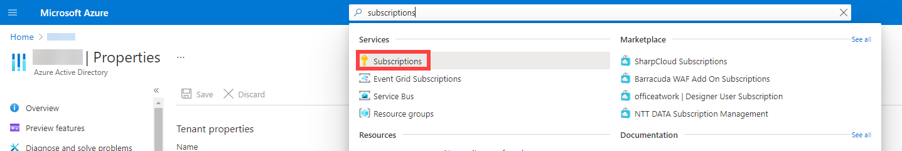
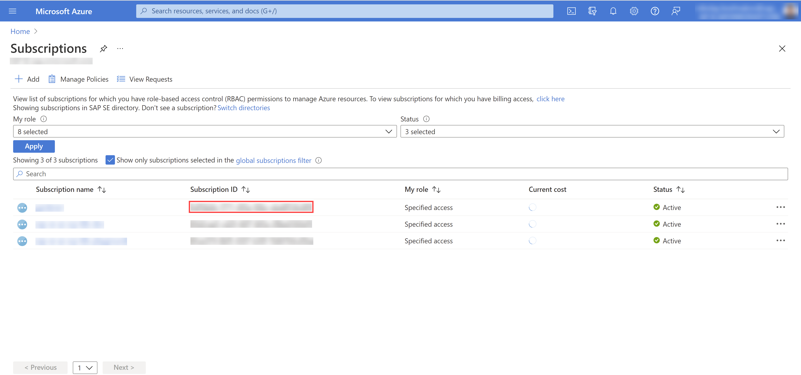
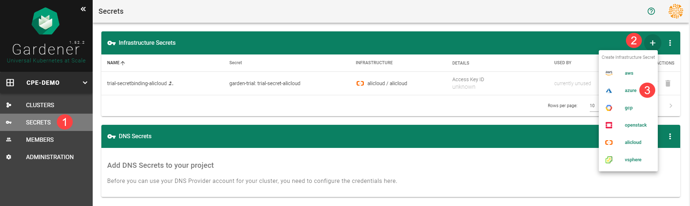
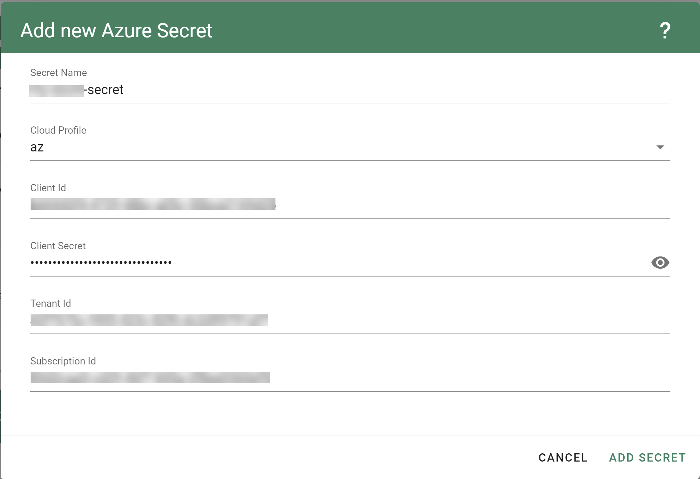
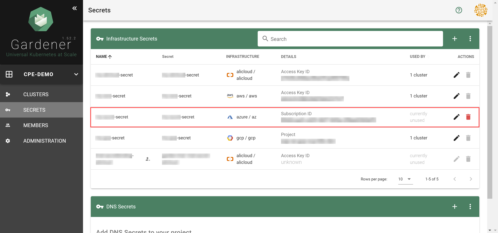
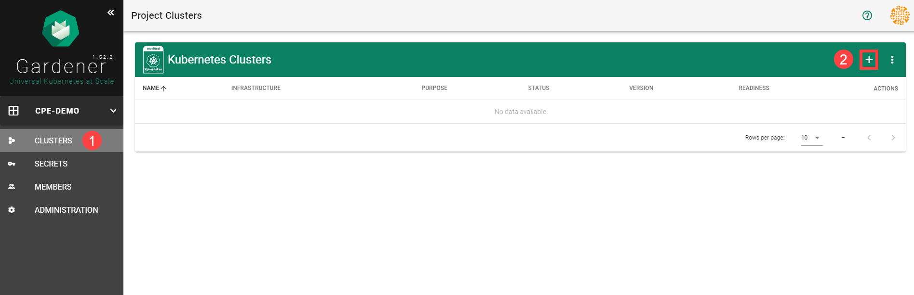
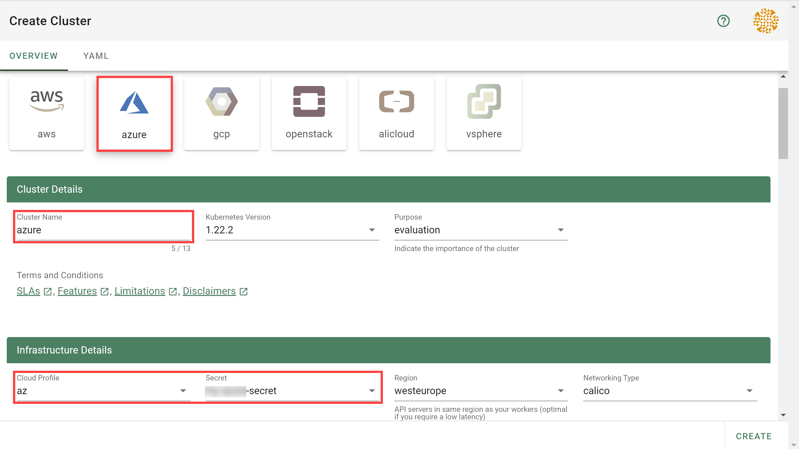
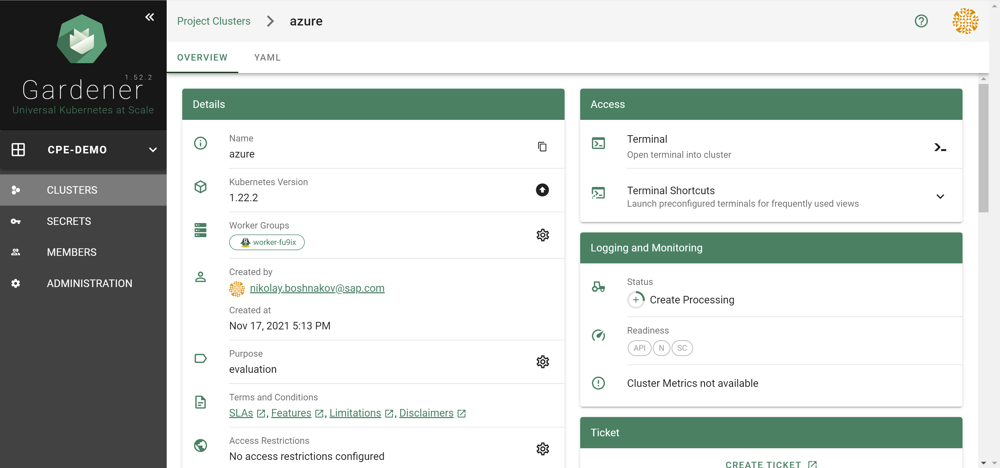
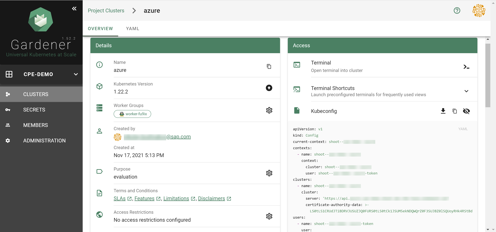

### Overview

### Prerequisites

- You have created an [Azure account](https://azure.microsoft.com/en-us/).
- You have access to the Gardener dashboard and have permissions to create projects.
- You have an Azure Service Principal assigned to your subscription.

### Steps

1. Go to the Gardener dashboard and create a *Project*.

    


1. Get the properties of your Azure AD tenant, Subscription and Service Principal.
    ```
    Before you can provision and access a Kubernetes cluster on Azure, you need to add the Azure service principal, AD tenant and subscription credentials in Gardener. 
    Gardener needs the credentials to provision and operate the Azure infrastructure for your Kubernetes cluster.

    **Ensure that the Azure service principal has the `Contributor` role within your Subscription assigned.**
    ```


    - Tenant ID

        To find your TenantID, follow this [guide](https://docs.microsoft.com/en-us/azure/active-directory/fundamentals/active-directory-how-to-find-tenant).

    - SubscriptionID

        To find your SubscriptionID, search for and select *Subscriptions*.
        

        After that, copy the SubscriptionID from your subscription of choice.
        

    - Service Principal (SPN)

        A service principal consist of a `ClientID` (also called `ApplicationID`) and a Client Secret. For more information, see [here](https://docs.microsoft.com/en-us/azure/active-directory/develop/app-objects-and-service-principals). You need to obtain the:
        - Client ID 

            Access the [Azure Portal](https://portal.azure.com) and navigate to the `Active Directory` service.
            Within the service navigate to `App registrations` and select your service principal. Copy the ClientID you see there.


        - Client Secret

            Secrets for the Azure Account/Service Principal can be generated/rotated via the Azure Portal.
            After copying your ClientID, in the `Detail` view of your Service Principal navigate to `Certificates & secrets`. In the section, you can generate a new secret.

1. Choose *Secrets*, then the plus icon  and select *Azure*.

    

1. Create your secret.

    1. Type the name of your secret.
    1. Copy and paste the `TenantID`, `SubscriptionID` and the Service Principal credentials (`ClientID` and `ClientSecret`).
    3. Choose *Add secret*.
    

    >After completing these steps, you should see your newly created secret in the *Infrastructure Secrets* section.

    

1. To create a new cluster, choose *Clusters* and then the plus sign in the upper right corner.

    

1. In the *Create Cluster* section:
    1. Select *Azure* in the *Infrastructure* tab.
    1. Type the name of your cluster in the *Cluster Details* tab.
    1. Choose the secret you created before in the *Infrastructure Details* tab.
    1. Choose *Create*.

    

1. Wait for your cluster to get created.

    

### Result

After completing the steps in this tutorial, you will be able to see and download the kubeconfig of your cluster.

  