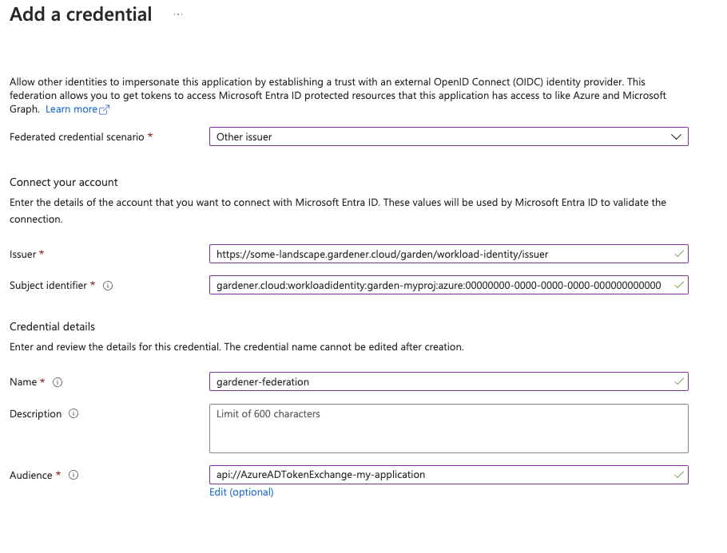

# Using the Azure provider extension with Gardener as end-user

The [`core.gardener.cloud/v1beta1.Shoot` resource](https://github.com/gardener/gardener/blob/master/example/90-shoot.yaml) declares a few fields that are meant to contain provider-specific configuration.

This document describes the configurable options for Azure and provides an example `Shoot` manifest with minimal configuration that can be used to create an Azure cluster (modulo the landscape-specific information like cloud profile names, secret binding names, etc.).

## Azure Provider Credentials

In order for Gardener to create a Kubernetes cluster using Azure infrastructure components, a Shoot has to provide credentials with sufficient permissions to the desired Azure subscription.
Every shoot cluster references a `SecretBinding` or a [`CredentialsBinding`](https://gardener.cloud/docs/gardener/api-reference/security/#security.gardener.cloud/v1alpha1.CredentialsBinding).
`SecretBinding`s reference a `Secret` while `CredentialsBinding`s can reference a `Secret` or a `WorkloadIdentity`.
A `Secret` would contain the provider credentials of the Azure subscription while a `WorkloadIdentity` would be used to represent an identity of Gardener managed workload.

> [!IMPORTANT]
> The `SecretBinding`/`CredentialsBinding` is configurable in the [Shoot cluster](https://github.com/gardener/gardener/blob/master/example/90-shoot.yaml) with the field `secretBindingName`/`credentialsBindingName`.
> `SecretBinding`s are considered legacy and will be deprecated in the future.
> It is advised to use `CredentialsBinding`s instead.

Create an [Azure Application and Service Principle](https://docs.microsoft.com/en-us/azure/active-directory/develop/howto-create-service-principal-portal) and obtain its credentials.

Please ensure that the Azure application (spn) has the IAM actions defined [here](azure-permissions.md) assigned.
If no fine-grained permissions/actions required then simply assign the [Contributor](https://docs.microsoft.com/en-us/azure/role-based-access-control/built-in-roles#contributor) role.

The example below demonstrates how the secret containing the client credentials of the Azure Application has to look like:

```yaml
apiVersion: v1
kind: Secret
metadata:
  name: core-azure
  namespace: garden-dev
type: Opaque
data:
  clientID: base64(client-id)
  clientSecret: base64(client-secret)
  subscriptionID: base64(subscription-id)
  tenantID: base64(tenant-id)
```

> [!WARNING]
> Depending on your API usage it can be problematic to reuse the same Service Principal for different Shoot clusters due to rate limits.
> Please consider spreading your Shoots over Service Principals from different Azure subscriptions if you are hitting those limits.

### Managed Service Principals

The operators of the Gardener Azure extension can provide managed service principals.
This eliminates the need for users to provide an own service principal for a Shoot.

To make use of a managed service principal, the Azure secret of a Shoot cluster must contain only a `subscriptionID` and a `tenantID` field, but no `clientID` and `clientSecret`.
Removing those fields from the secret of an existing Shoot will also let it adopt the managed service principal.

Based on the `tenantID` field, the Gardener extension will try to assign the managed service principal to the Shoot.
If no managed service principal can be assigned then the next operation on the Shoot will fail.

> [!WARNING]
> The managed service principal need to be assigned to the users Azure subscription with proper permissions before using it.

### Azure Workload Identity Federation

Users can choose to trust Gardener's Workload Identity Issuer and eliminate the need for providing Azure credentials.

As a first step a resource of type `WorkloadIdentity` should be created in the Garden cluster and configured with the required Azure information.
This identity will be used by infrastructure components to authenticate against Azure APIs.
A sample of such resource is shown below:

```yaml
apiVersion: security.gardener.cloud/v1alpha1
kind: WorkloadIdentity
metadata:
  name: azure
  namespace: garden-myproj
spec:
  audiences:
  # This is the audience that you configure during the creation of a federated credential
  - api://AzureADTokenExchange-my-application
  targetSystem:
    type: azure
    providerConfig:
      apiVersion: azure.provider.extensions.gardener.cloud/v1alpha1
      kind: WorkloadIdentityConfig
      clientID: 00000000-0000-0000-0000-000000000001 # This is the id of the application (client)
      tenantID: 00000000-0000-0000-0000-000000000002 # This is the id of the directory (tenant)
      subscriptionID: 00000000-0000-0000-0000-000000000003 # This is the id of the Azure subscription
```

Once created the `WorkloadIdentity` will get its own id which will be used to form the subject of the said `WorkloadIdentity`.
The subject can be obtained by running the following command:

```bash
kubectl -n garden-myproj get wi azure -o=jsonpath={.status.sub}
```

As a second step users should configure [Workload Identity Federation](https://learn.microsoft.com/en-us/entra/workload-id/workload-identity-federation-create-trust?pivots=identity-wif-apps-methods-azp#other-identity-providers) so that their application trusts Gardener's Workload Identity Issuer.

> [!TIP]
> You can retrieve Gardener's Workload Identity Issuer URL directly from the Garden cluster by reading the contents of the [Gardener Info ConfigMap](https://gardener.cloud/docs/gardener/gardener/gardener_info_configmap/).
>
> ```bash
> kubectl -n gardener-system-public get configmap -o yaml
> ```

In the shown example a `WorkloadIdentity` with name `azure` with id `00000000-0000-0000-0000-000000000000` from the `garden-myproj` namespace will be trusted by the Azure application.

> [!IMPORTANT]
> You should replace the subject identifier in the example below with the subject that is populated in the status of the `WorkloadIdentity`, obtained in a previous step.



Please ensure that the Azure application (spn) has the proper [IAM actions](azure-permissions.md) assigned.
If no fine-grained permissions/actions required then simply assign the [Contributor](https://docs.microsoft.com/en-us/azure/role-based-access-control/built-in-roles#contributor) role.

Once you have everything set you can create a `CredentialsBinding` that reference the `WorkloadIdentity` and configure your shoot to use it.
Please see the following examples:

```yaml
apiVersion: security.gardener.cloud/v1alpha1
kind: CredentialsBinding
metadata:
  name: azure
  namespace: garden-myproj
credentialsRef:
  apiVersion: security.gardener.cloud/v1alpha1
  kind: WorkloadIdentity
  name: azure
  namespace: garden-myproj
provider:
  type: azure
```

```yaml
apiVersion: core.gardener.cloud/v1beta1
kind: Shoot
metadata:
  name: azure
  namespace: garden-myproj
spec:
  credentialsBindingName: azure
  ...
```

## `InfrastructureConfig`

The infrastructure configuration mainly describes how the network layout looks like in order to create the shoot worker nodes in a later step, thus, prepares everything relevant to create VMs, load balancers, volumes, etc.

An example `InfrastructureConfig` for the Azure extension looks as follows:

```yaml
apiVersion: azure.provider.extensions.gardener.cloud/v1alpha1
kind: InfrastructureConfig
networks:
  vnet: # specify either 'name' and 'resourceGroup' or 'cidr'. If none of them are set, the value of networks.workers will be used.
    # name: my-vnet
    # resourceGroup: my-vnet-resource-group
    cidr: 10.250.0.0/16
    # ddosProtectionPlanID: /subscriptions/test/resourceGroups/test/providers/Microsoft.Network/ddosProtectionPlans/test-ddos-protection-plan
  workers: 10.250.0.0/19
#  # natGateway can only be set together with networks.workers
#  natGateway:
#    enabled: true
#    idleConnectionTimeoutMinutes: 4
#    zone: 1
#    ipAddresses:
#    - name: my-public-ip-name
#      resourceGroup: my-public-ip-resource-group
#      zone: 1
#  # serviceEndpoints can only be set together with vnet.workers
#  serviceEndpoints:
#  - Microsoft.Test
zoned: false
#identity:
#  name: my-identity-name
#  resourceGroup: my-identity-resource-group
#  acrAccess: true
```

It is **not** possible to deploy **all** infrastructure resources into an existing resource group.

Via the `.zoned` boolean you can tell whether you want to use Azure availability zones or not.
When `.zoned` is set to false, the cluster will use VMSS-Flex as the backend of the worker nodes.
You can read more about VMSS Flex in the [Azure Virtual Machine ScaleSet with flexible orchestration page](https://docs.microsoft.com/en-us/azure/virtual-machine-scale-sets/virtual-machine-scale-sets-orchestration-modes#scale-sets-with-flexible-orchestration).

The `networks.vnet` section describes whether you want to create the shoot cluster in an already existing VNet or whether to create a new one:

* If `networks.vnet.name` and `networks.vnet.resourceGroup` are given then you have to specify the VNet name and VNet resource group name of the existing VNet that was created by other means (manually, other tooling, ...).
Ensure that both `networks.workers` and `networking.nodes` are within the CIDR range of your created VNet, but do not overlap with already existing subnets.
A subnet for the nodes will be created within the specified VNet to host the machines. However, the machines and all other resources will reside in a separate resource group managed by gardener.
* If `networks.vnet.cidr` is given then you have to specify the VNet CIDR of a new VNet that will be created during shoot creation.
You can freely choose a private CIDR range.
* Either `networks.vnet.name` and `networks.vnet.resourceGroup` or `networks.vnet.cidr` must be present, but not both at the same time.
In case none of them are set, the `networks.workers` CIDR will be used to create the new VNet.
* The `networks.vnet.ddosProtectionPlanID` field can be used to specify the id of a ddos protection plan which should be assigned to the VNet. This will only work for a VNet managed by Gardener. For externally managed VNets the ddos protection plan must be assigned by other means.
* If a vnet name is given and cilium shoot clusters are created without a network overlay within one vnet make sure that the pod CIDR specified in `shoot.spec.networking.pods` is not overlapping with any other pod CIDR used in that vnet.
Overlapping pod CIDRs will lead to disfunctional shoot clusters.
* It's possible to place multiple shoot cluster into the same vnet

The `networks.workers` section describes the CIDR for a subnet that is used for all shoot worker nodes, i.e., VMs which later run your applications.
The specified CIDR range must be contained in the VNet CIDR specified above, or the VNet CIDR of your already existing VNet.
You can freely choose this CIDR and it is your responsibility to properly design the network layout to suit your needs.

In the `networks.serviceEndpoints[]` list you can specify the list of Azure service endpoints which shall be associated with the worker subnet. All available service endpoints and their technical names can be found in the (Azure Service Endpoint documentation](https://docs.microsoft.com/en-us/azure/virtual-network/virtual-network-service-endpoints-overview).

The `networks.natGateway` section contains configuration for the Azure NatGateway which can be attached to the worker subnet of a Shoot cluster.
Here are some key information about the usage of the NatGateway for a Shoot cluster:
- If the NatGateway is not used then the egress connections initiated within the Shoot cluster will be nated via the LoadBalancer of the clusters (default Azure behaviour, see [here](https://docs.microsoft.com/en-us/azure/load-balancer/load-balancer-outbound-connections#scenarios)).
- The NatGateway is currently **not** zone redundantly deployed.
  That means the NatGateway of a Shoot cluster will always be in just one zone. This zone can be optionally selected via `.networks.natGateway.zone`.
- **Caution:** Modifying the `.networks.natGateway.zone` setting requires a recreation of the NatGateway and the managed public ip (automatically used if no own public ip is specified, see below).
  That means you will most likely get a different public ip for egress connections.
- It is possible to bring own zonal public ip(s) via `networks.natGateway.ipAddresses`.
  Those public ip(s) need to be in the same zone as the NatGateway (see `networks.natGateway.zone`) and be of SKU `standard`.
  For each public ip the `name`, the `resourceGroup` and the `zone` need to be specified.
  If you provide your own public IPs, the shoot’s `status.networking.egressCIDRs` field will be populated with those addresses.
  If you don’t, the field remains empty because it depends on the public IP of your load balancers and hence it can change at runtime depending on the services you create/delete.
  Since the set of egress IPs cannot be determined in advance in this scenario, we intentionally leave the field empty.
- The field `networks.natGateway.idleConnectionTimeoutMinutes` allows the configuration of NAT Gateway's idle connection timeout property.
  The idle timeout value can be adjusted from 4 minutes, up to 120 minutes.
  Omitting this property will set the idle timeout to its default value according to [NAT Gateway's documentation](https://docs.microsoft.com/en-us/azure/virtual-network/nat-gateway-resource#timers).

In the `identity` section you can specify an [Azure user-assigned managed identity](https://docs.microsoft.com/en-us/azure/active-directory/managed-identities-azure-resources/overview#how-does-the-managed-identities-for-azure-resources-work) which should be attached to all cluster worker machines. With `identity.name` you can specify the name of the identity and with `identity.resourceGroup` you can specify the resource group which contains the identity resource on Azure. The identity need to be created by the user upfront (manually, other tooling, ...). Gardener/Azure Extension will only use the referenced one and won't create an identity. Furthermore the identity have to be in the same subscription as the Shoot cluster. Via the `identity.acrAccess` you can configure the worker machines to use the passed identity for pulling from an [Azure Container Registry (ACR)](https://docs.microsoft.com/en-us/azure/container-registry/container-registry-intro).
**Caution:** Adding, exchanging or removing the identity will require a rolling update of all worker machines in the Shoot cluster.

Apart from the VNet and the worker subnet the Azure extension will also create a dedicated resource group, route tables, security groups and a VMSS-Flex group depending on the configuration.

### InfrastructureConfig with dedicated subnets per zone

Another deployment option **for zonal clusters only**, is to create and configure a separate subnet per availability zone. This network layout is recommended to users that require fine-grained control over their network setup. One prevalent usecase is to create a zone-redundant NAT Gateway deployment by taking advantage of the ability to deploy separate NAT Gateways for each subnet.

To use this configuration the following requirements must be met:

- the `zoned` field must be set to `true`.
- the `networks.vnet` section must not be empty and must contain a valid configuration. For existing clusters that were not using the `networks.vnet` section, it is enough if `networks.vnet.cidr` field is set to the current `networks.worker` value.

For each of the target zones a subnet CIDR range must be specified. The specified CIDR range must be contained in the VNet CIDR specified above, or the VNet CIDR of your already existing VNet. In addition, the CIDR ranges must not overlap with the ranges of the other subnets.

_ServiceEndpoints_ and _NatGateways_ can be configured per subnet. Respectively, when `networks.zones` is specified, the fields `networks.workers`, `networks.serviceEndpoints` and `networks.natGateway` cannot be set. All the configuration for the subnets must be done inside the respective zone's configuration.

Example:

```yaml
apiVersion: azure.provider.extensions.gardener.cloud/v1alpha1
kind: InfrastructureConfig
networks:
  zoned: true
  vnet: # specify either 'name' and 'resourceGroup' or 'cidr'
    cidr: 10.250.0.0/16
  zones:
  - name: 1
    cidr: "10.250.0.0/24"
  - name: 2
    cidr: "10.250.0.0/24"
    natGateway:
      enabled: false
```

### Migrating to zonal shoots with dedicated subnets per zone

For existing zonal clusters it is possible to migrate to a network layout with dedicated subnets per zone. The migration works by creating additional network resources as specified in the configuration and progressively roll part of your existing nodes to use the new resources. To achieve the controlled rollout of your nodes, parts of the existing infrastructure must be preserved which is why the following constraint is imposed:

One of your specified zones must have the exact same CIDR range as the current `network.workers` field. Here is an example of such migration:

```yaml
infrastructureConfig:
  apiVersion: azure.provider.extensions.gardener.cloud/v1alpha1
  kind: InfrastructureConfig
  networks:
    vnet:
      cidr: 10.250.0.0/16
    workers: 10.250.0.0/19
  zoned: true
```

to

```yaml
infrastructureConfig:
  apiVersion: azure.provider.extensions.gardener.cloud/v1alpha1
  kind: InfrastructureConfig
  networks:
    vnet:
      cidr: 10.250.0.0/16
    zones:
      - name: 3
        cidr: 10.250.0.0/19 # note the preservation of the 'workers' CIDR
# optionally add other zones
#     - name: 2
#       cidr: 10.250.32.0/19
#       natGateway:
#         enabled: true
  zoned: true
```

Another more advanced example with user-provided public IP addresses for the NAT Gateway and how it can be migrated:

```yaml
infrastructureConfig:
  apiVersion: azure.provider.extensions.gardener.cloud/v1alpha1
  kind: InfrastructureConfig
  networks:
    vnet:
      cidr: 10.250.0.0/16
    workers: 10.250.0.0/19
    natGateway:
      enabled: true
      zone: 1
      ipAddresses:
        - name: pip1
          resourceGroup: group
          zone: 1
        - name: pip2
          resourceGroup: group
          zone: 1
  zoned: true
```

to

```yaml
infrastructureConfig:
  apiVersion: azure.provider.extensions.gardener.cloud/v1alpha1
  kind: InfrastructureConfig
  zoned: true
  networks:
    vnet:
      cidr: 10.250.0.0/16
    zones:
      - name: 1
        cidr: 10.250.0.0/19 # note the preservation of the 'workers' CIDR
        natGateway:
          enabled: true
          ipAddresses:
            - name: pip1
              resourceGroup: group
              zone: 1
            - name: pip2
              resourceGroup: group
              zone: 1
# optionally add other zones
#     - name: 2
#       cidr: 10.250.32.0/19
#       natGateway:
#         enabled: true
#         ipAddresses:
#           - name: pip3
#             resourceGroup: group
```

You can apply such change to your shoot by issuing a `kubectl patch` command to replace your current `.spec.provider.infrastructureConfig` section:

```
$ cat new-infra.json

[
  {
    "op": "replace",
    "path": "/spec/provider/infrastructureConfig",
    "value": {
      "apiVersion": "azure.provider.extensions.gardener.cloud/v1alpha1",
      "kind": "InfrastructureConfig",
      "networks": {
        "vnet": {
          "cidr": "<your-vnet-cidr>"
        },
        "zones": [
          {
            "name": 1,
            "cidr": "10.250.0.0/24",
            "natGateway": {
              "enabled": true
            }
          },
          {
            "name": 1,
            "cidr": "10.250.1.0/24",
            "natGateway": {
              "enabled": true
            }
          },
        ]
      },
      "zoned": true
    }
  }
]

kubectl patch --type="json" --patch-file new-infra.json shoot <my-shoot>
```

> [!WARNING]
> The migration to shoots with dedicated subnets per zone is a one-way process. Reverting the shoot to the previous configuration is not supported.
> During the migration a subset of the nodes will be rolled to the new subnets.

## `ControlPlaneConfig`

The control plane configuration mainly contains values for the Azure-specific control plane components.
Today, the only component deployed by the Azure extension is the `cloud-controller-manager`.

An example `ControlPlaneConfig` for the Azure extension looks as follows:

```yaml
apiVersion: azure.provider.extensions.gardener.cloud/v1alpha1
kind: ControlPlaneConfig
cloudControllerManager:
# featureGates:
#   SomeKubernetesFeature: true
```

The `cloudControllerManager.featureGates` contains a map of explicitly enabled or disabled feature gates.
For production usage it's not recommend to use this field at all as you can enable alpha features or disable beta/stable features, potentially impacting the cluster stability.
If you don't want to configure anything for the `cloudControllerManager` simply omit the key in the YAML specification.

`storage` contains options for storage-related control plane component.
`storage.managedDefaultStorageClass` is enabled by default and will deploy a `storageClass` and mark it as a default (via the `storageclass.kubernetes.io/is-default-class` annotation)
`storage.managedDefaultVolumeSnapshotClass` is enabled by default and will deploy a `volumeSnapshotClass` and mark it as a default (via the `snapshot.storage.kubernetes.io/is-default-classs` annotation)
In case you want to manage your own default `storageClass` or `volumeSnapshotClass` you need to disable the respective options above, otherwise reconciliation of the controlplane may fail.


## `WorkerConfig`

The Azure extension supports encryption for volumes plus support for additional data volumes per machine.
Please note that you cannot specify the `encrypted` flag for Azure disks as they are encrypted by default/out-of-the-box.
For each data volume, you have to specify a name.
The following YAML is a snippet of a `Shoot` resource:

```yaml
spec:
  provider:
    workers:
    - name: cpu-worker
      ...
      volume:
        type: Standard_LRS
        size: 20Gi
      dataVolumes:
      - name: kubelet-dir
        type: Standard_LRS
        size: 25Gi
```

Additionally, it supports for other Azure-specific values and could be configured under `.spec.provider.workers[].providerConfig`

An example `WorkerConfig` for the Azure extension looks like:

```yaml
apiVersion: azure.provider.extensions.gardener.cloud/v1alpha1
kind: WorkerConfig
nodeTemplate: # (to be specified only if the node capacity would be different from cloudprofile info during runtime)
  capacity:
    cpu: 2
    gpu: 1
    memory: 50Gi
diagnosticsProfile:
  enabled: true
  # storageURI: https://<storage-account-name>.blob.core.windows.net/
dataVolumes:
  - name: test-image
    imageRef:
      communityGalleryImageID: /CommunityGalleries/gardenlinux-13e998fe-534d-4b0a-8a27-f16a73aef620/Images/gardenlinux/Versions/1443.10.0
      # sharedGalleryImageID: /SharedGalleries/82fc46df-cc38-4306-9880-504e872cee18-VSMP_MEMORYONE_GALLERY/Images/vSMP_MemoryONE/Versions/1062800168.0.0
      # id: /Subscriptions/2ebd38b6-270b-48a2-8e0b-2077106dc615/Providers/Microsoft.Compute/Locations/westeurope/Publishers/sap/ArtifactTypes/VMImage/Offers/gardenlinux/Skus/greatest/Versions/1443.10.0
      # urn: sap:gardenlinux:greatest:1443.10.0
volume:
  cachingType: ReadWrite
```

The `.nodeTemplate` is used to specify resource information of the machine during runtime. This then helps in Scale-from-Zero.
Some points to note for this field:
- Currently only cpu, gpu and memory are configurable.
- a change in the value lead to a rolling update of the machine in the worker pool
- all the resources needs to be specified

The `.diagnosticsProfile` is used to enable [machine boot diagnostics](https://learn.microsoft.com/en-us/azure/virtual-machines/boot-diagnostics) (disabled per default).
A storage account is used for storing vm's boot console output and screenshots.
If `.diagnosticsProfile.StorageURI` is not specified azure managed storage will be used (recommended way).

The `.dataVolumes` field is used to add provider specific configurations for dataVolumes.
`.dataVolumes[].name` must match with one of the names in `workers.dataVolumes[].name`.
To specify an image source for the dataVolume either use `communityGalleryImageID`, `sharedGalleryImageID`, `id` or `urn` as `imageRef`.
However, users have to make sure that the image really exists, there's yet no check in place.
If the image does not exist the machine will get stuck in creation.

The `.volume` field is used to add provider specific configurations for a osDisk.
The OS disk is the disk that contains the operating system and is mounted as `/` in the machine.
You can configure the host caching type by specifying `.volume.caching` in the workerConfig.
The default value is `None`, current supported values are `None`, `ReadOnly`, `ReadWrite`.

## Example `Shoot` manifest (non-zoned)

Please find below an example `Shoot` manifest for a non-zoned cluster:

```yaml
apiVersion: core.gardener.cloud/v1beta1
kind: Shoot
metadata:
  name: johndoe-azure
  namespace: garden-dev
spec:
  cloudProfile:
    name: azure
  region: westeurope
  credentialsBindingName: core-azure
  provider:
    type: azure
    infrastructureConfig:
      apiVersion: azure.provider.extensions.gardener.cloud/v1alpha1
      kind: InfrastructureConfig
      networks:
        vnet:
          cidr: 10.250.0.0/16
        workers: 10.250.0.0/19
      zoned: false
    controlPlaneConfig:
      apiVersion: azure.provider.extensions.gardener.cloud/v1alpha1
      kind: ControlPlaneConfig
    workers:
    - name: worker-xoluy
      machine:
        type: Standard_D4_v3
      minimum: 2
      maximum: 2
      volume:
        size: 50Gi
        type: Standard_LRS
#      providerConfig:
#        apiVersion: azure.provider.extensions.gardener.cloud/v1alpha1
#        kind: WorkerConfig
#        nodeTemplate: # (to be specified only if the node capacity would be different from cloudprofile info during runtime)
#          capacity:
#            cpu: 2
#            gpu: 1
#            memory: 50Gi
  networking:
    type: calico
    pods: 100.96.0.0/11
    nodes: 10.250.0.0/16
    services: 100.64.0.0/13
  kubernetes:
    version: 1.32.0
  maintenance:
    autoUpdate:
      kubernetesVersion: true
      machineImageVersion: true
  addons:
    kubernetesDashboard:
      enabled: true
    nginxIngress:
      enabled: true
```

## Example `Shoot` manifest (zoned)

Please find below an example `Shoot` manifest for a zoned cluster:

```yaml
apiVersion: core.gardener.cloud/v1beta1
kind: Shoot
metadata:
  name: johndoe-azure
  namespace: garden-dev
spec:
  cloudProfile:
    name: azure
  region: westeurope
  credentialsBindingName: core-azure
  provider:
    type: azure
    infrastructureConfig:
      apiVersion: azure.provider.extensions.gardener.cloud/v1alpha1
      kind: InfrastructureConfig
      networks:
        vnet:
          cidr: 10.250.0.0/16
        workers: 10.250.0.0/19
      zoned: true
    controlPlaneConfig:
      apiVersion: azure.provider.extensions.gardener.cloud/v1alpha1
      kind: ControlPlaneConfig
    workers:
    - name: worker-xoluy
      machine:
        type: Standard_D4_v3
      minimum: 2
      maximum: 2
      volume:
        size: 50Gi
        type: Standard_LRS
      zones:
      - "1"
      - "2"
  networking:
    type: calico
    pods: 100.96.0.0/11
    nodes: 10.250.0.0/16
    services: 100.64.0.0/13
  kubernetes:
    version: 1.32.0
  maintenance:
    autoUpdate:
      kubernetesVersion: true
      machineImageVersion: true
  addons:
    kubernetesDashboard:
      enabled: true
    nginxIngress:
      enabled: true
```

## Example `Shoot` manifest (zoned with NAT Gateways per zone)

Please find below an example `Shoot` manifest for a zoned cluster using NAT Gateways per zone:

```yaml
apiVersion: core.gardener.cloud/v1beta1
kind: Shoot
metadata:
  name: johndoe-azure
  namespace: garden-dev
spec:
  cloudProfile:
    name: azure
  region: westeurope
  credentialsBindingName: core-azure
  provider:
    type: azure
    infrastructureConfig:
      apiVersion: azure.provider.extensions.gardener.cloud/v1alpha1
      kind: InfrastructureConfig
      networks:
        vnet:
          cidr: 10.250.0.0/16
        zones:
        - name: 1
          cidr: 10.250.0.0/24
          serviceEndpoints:
          - Microsoft.Storage
          - Microsoft.Sql
          natGateway:
            enabled: true
            idleConnectionTimeoutMinutes: 4
        - name: 2
          cidr: 10.250.1.0/24
          serviceEndpoints:
          - Microsoft.Storage
          - Microsoft.Sql
          natGateway:
            enabled: true
      zoned: true
    controlPlaneConfig:
      apiVersion: azure.provider.extensions.gardener.cloud/v1alpha1
      kind: ControlPlaneConfig
    workers:
    - name: worker-xoluy
      machine:
        type: Standard_D4_v3
      minimum: 2
      maximum: 2
      volume:
        size: 50Gi
        type: Standard_LRS
      zones:
      - "1"
      - "2"
  networking:
    type: calico
    pods: 100.96.0.0/11
    nodes: 10.250.0.0/16
    services: 100.64.0.0/13
  kubernetes:
    version: 1.32.0
  maintenance:
    autoUpdate:
      kubernetesVersion: true
      machineImageVersion: true
  addons:
    kubernetesDashboard:
      enabled: true
    nginxIngress:
      enabled: true
```

## CSI volume provisioners

Every Azure shoot cluster will be deployed with the Azure Disk CSI driver and the Azure File CSI driver.

## Kubernetes Versions per Worker Pool

This extension supports `gardener/gardener`'s `WorkerPoolKubernetesVersion` feature gate, i.e., having [worker pools with overridden Kubernetes versions](https://github.com/gardener/gardener/blob/8a9c88866ec5fce59b5acf57d4227eeeb73669d7/example/90-shoot.yaml#L69-L70) since `gardener-extension-provider-azure@v1.25`.

## Shoot CA Certificate and `ServiceAccount` Signing Key Rotation

This extension supports `gardener/gardener`'s `ShootCARotation` and `ShootSARotation` feature gates since `gardener-extension-provider-azure@v1.28`.

## Miscellaneous

### Azure Accelerated Networking

All worker machines of the cluster will be automatically configured to use [Azure Accelerated Networking](https://docs.microsoft.com/en-us/azure/virtual-network/create-vm-accelerated-networking-cli) if the prerequisites are fulfilled.
The prerequisites are that the used machine type and operating system image version are compatible for Accelerated Networking.
Supported machine types are listed in the CloudProfile in `.spec.providerConfig.machineTypes[].acceleratedNetworking` and the supported operating system image versions are defined in `.spec.providerConfig.machineImages[].versions[].acceleratedNetworking`.

### Support for other Azure instances

The provider extension can be configured to connect to Azure instances other than the public one by providing additional configuration in the CloudProfile:
```yaml
spec:
  …
  providerConfig:
    apiVersion: azure.provider.extensions.gardener.cloud/v1alpha1
    kind: CloudProfileConfig
    cloudConfiguration:
      name: AzurePublic # AzurePublic | AzureGovernment | AzureChina
    machineTypes:
      …
    …
  …
```
If no configuration is specified the extension will default to the public instance.
Azure instances other than `AzurePublic`, `AzureGovernment`, or `AzureChina` are not supported at this time.

### Disabling the automatic deployment of `allow-{tcp,udp} loadbalancer services`

Using the `azure-cloud-controller-manager` when a user first creates a loadbalancer service in the cluster, a new Load Balancer is created in Azure and all nodes of the cluster are registered as backend.
When a NAT Gateway is not used, then this Load Balancer is used as a NAT device for outbound traffic by using one of the registered FrontendIPs assigned to the k8s LB service.
In cases where a NATGateway is not used, `provider-azure` will deploy by default a set of 2 Load Balancer services in the `kube-system`.
These are responsible for allowing outbound traffic in all cases for UDP and TCP.

There is a way for users to disable the deployment of these additional LBs by using the `azure.provider.extensions.gardener.cloud/skip-allow-egress="true"` annotation on their shoot.
[!WARNING]
Disabling the system Load Balancers may affect the outbound of your shoot.
Before disabling them, users are highly advised to have created at least one Load Balancer for **TCP and UDP** or forward outbound traffic via a different route.

### Disabling default outbound access for the subnet

Using the `azure.provider.extensions.gardener.cloud/disable-default-outbound-access="true"` annotation on the shoot, users can disable the default outbound traffic for the worker subnet. This can be used to ensure what the shoot is unaffected by the deprecation of the default outbound traffic for nodes [see the official announcement](https://azure.microsoft.com/en-us/updates?id=default-outbound-access-for-vms-in-azure-will-be-retired-transition-to-a-new-method-of-internet-access).

This annotation is should only be used for testing and not production shoots. It will be removed in a future release shortly after the deprecation date by Azure.

### Support for VolumeAttributesClasses (Beta in k8s 1.31)

To have the CSI-driver configured to support the necessary features for [VolumeAttributesClasses](https://kubernetes.io/docs/concepts/storage/volume-attributes-classes/) on Azure for shoots with a k8s-version greater than 1.31, use the `azure.provider.extensions.gardener.cloud/enable-volume-attributes-class` annotation on the shoot. Keep in mind to also enable the required feature flags and runtime-config on the common kubernetes controllers (as outlined in the link above) in the shoot-spec.

For more information and examples on how to configure the volume attributes class, see [example](https://github.com/kubernetes-sigs/azuredisk-csi-driver/blob/release-1.31/deploy/example/modifyvolume/README.md) provided in the azuredisk-csi-driver repository.

### Support for on-demand capacity reservation

You can have your VMs deployed in existing capacity reservations that are part of a capacity reservation group. Setting this up is as simple as specifying the capacity reservation group's ID as part of the worker group's provider-config:

```yaml
    workers:
    - name: Foo
      providerConfig:
        apiVersion: azure.provider.extensions.gardener.cloud/v1alpha1
        kind: WorkerConfig
        capacityReservation:
          capacityReservationGroupID: <capacity reservation group ID>
        …
      …

```

[!NOTE]
Make sure the capacity reservations and the capacity reservation groups are configured appropriately for your shoot's workers. For zonal shoots that means that the configured capacity reservation group _must_ be zonal as well, and have a capacity reservation in each zone where a machine is to be deployed.

Please also see the [official documentation](https://learn.microsoft.com/en-us/azure/virtual-machines/capacity-reservation-overview).


### Force ReadCache caching mode for in-tree Azure Disk PVs

To have the in-tree Azure Disk PVs use ReadCache caching mode, use the `azure.provider.extensions.gardener.cloud/convert-rw-caching-mode-for-intree-pv="true"` annotation on the shoot.
This will force the Azure Disk in-tree PVs to use ReadCache caching mode instead of the default ReadWrite caching mode when they get attached to a node, irrespective of the caching mode defined in the PV.